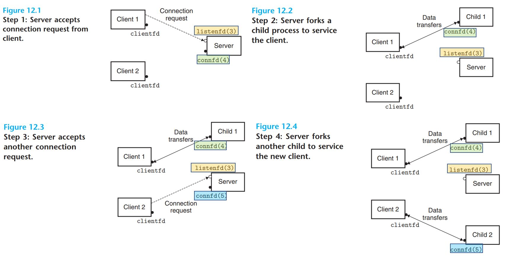

# Concurrent Programming

- As we learned in Chapter 8, **logical control flows are concurrent if they overlap in time**.
  - This general phenomenon, known as **concurrency concurrent**, shows up at many different levels of a computer system.
  - Hardware exception handlers, processes, and Linux signal handlers are all familiar examples.
  - Thus far, we have treated concurrency mainly as a mechanism that the operating system kernel uses to run multiple application programs.
  - But concurrency is not just limited to the **kernel**. It can play an important role in **application programs** as well.
  - For example, we have seen how Linux signal handlers allow applications to respond to asynchronous events such as the user typing Ctrl+C or the program accessing an undefined area of virtual memory.
- Application-level concurrency is useful in other ways as well:
  - **Accessing slow I/O devices**. When an application is waiting for data to arrive from a slow I/O device such as a disk, the kernel keeps the CPU busy by running other processes. Individual applications can exploit concurrency in a similar way by overlapping useful work with I/O requests.
  - **Interacting with humans**.  People who interact with computers demand the ability to perform multiple tasks at the same time. For example, they might want to resize a window while they are printing a document. Modern windowing systems use concurrency to provide this capability. Each time the user requests some action (say, by clicking the mouse), a separate concurrent logical flow is created to perform the action.
  - **Reducing latency by deferring work**. Sometimes, applications can use concurrency to reduce the latency of certain operations by deferring other operations and performing them concurrently. For example, a dynamic storage allocator might reduce the latency of individual free operations by deferring coalescing to a concurrent “coalescing” flow that runs at a lower priority, soaking up spare CPU cycles as they become available.
  - **Servicing multiple network clients**. The iterative network servers that we studied in Chapter 11 are unrealistic because they can only service one client at a time. Thus, a single slow client can deny service to every other client. For a real server that might be expected to service hundreds or thousands of clients per second, it is not acceptable to allow one slow client to deny service to the others. A better approach is to **build a concurrent server that creates a separate logical flow for each client.** This allows the server to service multiple clients concurrently and precludes slow clients from monopolizing the server.
  - Computing in parallel on multi-core machines. Many modern systems are equipped with multi-core processors that contain multiple CPUs. Applications that are partitioned into concurrent flows often run faster on multi-core machines than on uniprocessor machines because the flows execute in parallel rather than being interleaved. Applications that use application-level concurrency are known as concurrent programs.

- Modern operating systems provide three basic approaches for building concurrent programs:
  - :one: **Processes**. With this approach, each logical control flow is a process that is **scheduled and maintained by the kernel**. Since processes have separate virtual address spaces, flows that want to communicate with each other must use some kind of explicit interprocess communication (IPC) mechanism.
  - :two: **I/O multiplexing**.This is a form of concurrent programming where applications explicitly **schedule their own logical flows in the context of a single process.** Logical flows are modeled as state machines that the main program **explicitly transitions from state to state as a result of data arriving on file descriptors**. Since the program is a single process, **all flows share the same address space**.
  - :three: **Threads**. Threads are logical flows that run in the context of a single process and are scheduled by the kernel. You can think of threads as a hybrid of the other two approaches, **scheduled by the kernel like process flows** and **sharing the same virtual address space like I/O multiplexing flows.**

## Concurrent Programming with Processes

- The simplest way to build a concurrent program is with processes, using functions such as `fork`, `exec`, and `waitpid`.
- For example, a natural approach for building a concurrent server is to accept client connection requests in the parent and then create a new child process to service each new client.
  - 
  - To see how this might work, suppose we have two clients and a server that is listening for connection requests on a listening descriptor (say, 3).
  - Now suppose that the server accepts a connection request from client 1 and returns a connected descriptor (say, 4), as shown in Figure 12.1.
  - After accepting the connection request, the server forks a child, which **gets a complete copy of the server’s descriptor table**.
    - **The child closes its copy of listening descriptor 3**, and
    - **the parent closes its copy of connected descriptor 4**, since they are no longer needed.
    - This gives us the situation shown in Figure 12.2, where the child process is busy servicing the client.
  - Since the connected descriptors in the parent and child each point to the same file table entry, **it is crucial for the parent to close its copy of the connected descriptor**. Otherwise, **the file table entry for connected descriptor 4 will never be released, and the resulting memory leak will eventually consume the available memory and crash the system.**
  - Now suppose that after the parent creates the child for client 1, it accepts a new connection request from client 2 and returns a new connected descriptor (say, 5), as shown in Figure 12.3.
  - The parent then forks another child, which begins servicing its client using connected descriptor 5, as shown in Figure 12.4. At this point, the parent is waiting for the next connection request and the two children are servicing their respective clients concurrently.

## A Concurrent Server Based on Processes

- check [code](code/echoserver_process.h)

- Processes have a clean model for sharing state information between parents and children: file tables are shared and user address spaces are not.
- Having separate address spaces for processes is both an advantage and a disadvantage.
  - It is impossible for one process to accidentally overwrite the virtual memory of another process, which eliminates a lot of confusing failures—an obvious advantage.
  - On the other hand, separate address spaces make it more difficult for processes to share state information. To share information, they must use explicit IPC (interprocess communications) mechanisms.
  - Another disadvantage of process-based designs is that they tend to be slower because **the overhead for process control and IPC is high**.
- Note:  the term Unix IPC is typically reserved for a hodgepodge of techniques that allow processes to communicate with other processes that are running on the same host. Examples include pipes, FIFOs, System V shared memory, and System V semaphores. (Check: [The Linux Programming Interface](https://man7.org/tlpi/))

## Concurrent Programming with I/O Multiplexing

- Suppose you are asked to write an echo server that can also respond to interactive commands that the user types to standard input.
- 
- In this case, the server must respond to two independent I/O events:
  - (1) a network client making a connection request, and
  - (2) a user typing a command line at the keyboard.
- Which event do we wait for first? Neither option is ideal. If we are waiting for a connection request in `accept`, then we cannot respond to input commands. Similarly, if we are waiting for an input command in read, then we cannot respond to any connection requests.
- One solution to this dilemma is a technique called **I/O multiplexing**.
- The basic idea is to use the `select` function to **ask the kernel to suspend the process, returning control to the application only after one or more I/O events have occurred**, as in the following examples:
  - Return when any descriptor in the set {0, 4} is ready for **reading**.
  - Return when any descriptor in the set {1, 2, 7} is ready for **writing**.
  - **Time out** if 152.13 seconds have elapsed waiting for an I/O event to occur.

- `Select` is a complicated function with many different usage scenarios. We will only discuss the first scenario: **waiting for a set of descriptors to be ready for reading**.
- The `select` function manipulates sets of type `fd_set`, which are known as **descriptor sets**.
- Logically, we think of a descriptor set as a bit vector of size n: ${b_{n−1}, .... , b_1, b_0}$
  - Each bit $b_k$ corresponds to descriptor $k$.
  - Descriptor $k$ is a member of the descriptor set if and only if $b_k = 1$.
- You are only allowed to do three things with descriptor sets:
  - (1) allocate them,
  - (2) assign one variable of this type to another, and
  - (3) modify and inspect them using the `FD_ZERO`, `FD_SET`, `FD_CLR`, and `FD_ ISSET` macros.

- For our purposes, the `select` function takes two inputs:
  - a descriptor set (`fdset`) called the read set, and the cardinality (n) of the read set (actually the maximum cardinality of any descriptor set).
- The `select` function **blocks until at least one descriptor in the read set is ready for reading**.
- A descriptor $k$ is ready for reading **if and only if a request to read 1 byte from that descriptor would not block.**
  - As a side effect, `select` modifies the `fd_set` pointed to by argument `fdset` to indicate a subset of the read set called ***the ready set***, consisting of the descriptors in the read set that are ready for reading.
  - The value returned by the function indicates **the cardinality of the ready set**.
  - Note that because of the side effect, **we must update the read set every time `select` is called.**

- [code](code/echoserver_select_basic.h) shows how we might use `select` to implement an iterative echo server that also accepts user commands on the standard input.
  - We begin by using the `open_listenfd` function to open a listening descriptor (line 16), and
  - then using `FD_ZERO` to create an empty read set
  - Next, we define the read set to consist of descriptor 0 (standard input) and descriptor 3 (the listening descriptor), respectively
  - At this point, we begin the typical server loop.
  - But instead of waiting for a connection request by calling the `accept` function, we call the `select` function, which **blocks until either the listening descriptor or standard input is ready for reading** (line 24).
    - For example, here is the value of `ready_set` that select would return if the user hit the enter key, thus causing the standard input descriptor to.
  - Once `select` returns, we use the `FD_ISSET` macro to determine which descriptors are ready for reading.
    - If standard input is ready, we call the command function, which reads, parses, and responds to the command before returning to the main routine.
    - If the listening descriptor is ready, we call acc`ept to get a connected descriptor and then call the echo function from Figure 11.22, which echoes each line from the client until the client closes its end of the connection.
- While this program is a good example of using `select`, it still leaves something to be desired.
  - The problem is that **once it connects to a client, it continues echoing input lines until the client closes its end of the connection.**
  - Thus, if you type a command to standard input, **you will not get a response until the server is finished with the client.**
  - A better approach would be to multiplex at a finer granularity, echoing (at most) one text line each time through the server loop.

## A Concurrent Event-Driven Server Based on I/O Multiplexing

- I/O multiplexing can be used as the basis for concurrent event-driven programs, where **flows make progress as a result of certain events.**
- The general idea is to **model logical flows as state machines**.
  - Informally, a state machine is a collection of states, input events, and transitions that map states and input events to states.
  - Each transition maps an (input state, input event) pair to an output state.
  - A self-loop is a transition between the same input and output state.
  - State machines are typically drawn as directed graphs, where nodes represent states, directed arcs represent transitions, and arc labels represent input events.
  - A state machine begins execution in some initial state. Each input event triggers a transition from the current state to the next state.
- For each new client k, a concurrent server based on I/O multiplexing creates a new state machine $s_k$ and associates it with connected descriptor $d_k$.
- Each state machine $s_k$ has one state (“waiting for descriptor $d_k$ to be ready for reading”), one input event (“descriptor dk is ready for reading”), and one transition (“read a text line from descriptor dk”) The server uses the I/O multiplexing, courtesy of the select function, to detect the occurrence of input events. As each connected descriptor becomes ready for reading, the server executes the transition for the corresponding state machine - in this case, reading and echoing a text line from the descriptor.
- [code](code/echoserver_select.h) shows the complete example code for a concurrent event-driven server based on I/O multiplexing.

# Pros and Cons of I/O Multiplexing

- One advantage is that event-driven designs give programmers more control over the behavior of their programs than process-based designs.
  - For example, we can imagine writing an event-driven concurrent server that gives preferred service to some clients, which would be difficult for a concurrent server based on processes.
- Another advantage is that an event-driven server based on I/O multiplexing runs in the context of a single process, and
  - thus **every logical flow has access to the entire address space of the process**. This makes it easy to share data between flows.
  - A related advantage of running as a single process is that you can debug your concurrent server as you would any sequential program, using a familiar debugging tool such as gdb.
- Finally, event-driven designs are often significantly more efficient than process-based designs because they **do not require a process context switch** to schedule a new flow.
- A significant disadvantage of event-driven designs is coding complexity.
  - Our event-driven concurrent echo server requires three times more code than the process-based server.
  - Unfortunately, the complexity increases as the granularity of the concurrency decreases.
  - By granularity, we mean the number of instructions that each logical flow executes per time slice. For instance, in our example concurrent server, the granularity of concurrency is the number of instructions required to read an entire text line. As long as some logical flow is busy reading a text line, no other logical flow can make progress. This is fine for our example, but it makes our event-driven server vulnerable to a malicious client that sends only a partial text line and then halts.
- Modifying an event-driven server to handle partial text lines is a nontrivial task, but it is handled cleanly and automatically by a process-based design.
- Another significant disadvantage of event-based designs is that they cannot fully utilize multi-core processors.

## Concurrent Programming with Threads

