# Memory hierarchy

## Introduction

A simple model of computer system is like:

- a CPU that executes instructions and
- a memory system that holds instructions and data for the CPU
- the assumption that isn't practical in the simple mode: the memory system is a linear array of bytes, and the CPU can access each memory location in a constant amount of time.


In practice, a memory system is a **hierarchy of storage devices** with different **capacities, costs, and access times.** 

- CPU registers hold the most frequently used data.
- Small, fast cache memories nearby the CPU act as **staging areas for a subset of the data and instructions** stored in the relatively slow main memory.
- The main memory s**tages data stored on large, slow disks**, which in turn often serve as staging areas for data stored on the disks or tapes of other machines connected by networks.


Memory hierarchies work because

- well-written programs tend to access the storage at any particular level more frequently than they access the storage at the next lower level.
- So the storage at the next level can be slower, and thus larger and cheaper per bit.

- The overall effect is a large pool of memory that costs as much as the cheap storage near the bottom of the hierarchy but that serves data to programs at the rate of the fast storage near the top of the hierarchy.


> :bulb: As a programmer, you need to understand the memory hierarchy because it has a big impact on the  performance of your applications.

- If the data your program needs are stored in a **CPU register**, then they can be accessed in **0 cycles** during the execution of the instruction.
- If stored in a **cache**, **4 to 75 cycles**.
- If stored in **main memory**, **hundreds of cycles**.
- If stored in **disk**, **tens of millions of cycles**!


Here, then, is a fundamental and enduring idea in computer systems: if you understand how the system moves data up and down the memory hierarchy, then you can write your application programs so that their data items are stored higher in the hierarchy, where the CPU can access them more quickly.

This idea centers around a fundamental property of computer programs known as **locality**.

- Programs with good locality tend to access the **same set of data items over and over again, or they tend to access sets of nearby data items.**
- Programs with good locality tend to **access more data items from the upper levels of the memory hierarchy** than programs with poor locality, and thus run faster.

## 6.1 Storage Technologies


### Accessing Main Memory

- Data flows back and forth between the processor and the DRAM main memory over shared electrical conduits called **buses**.
- Each transfer of data between the CPU and memory is accomplished with a series of steps called a **bus transaction**.
  - A read transaction transfers data from the main memory to the CPU. A write transaction transfers data from the CPU to the main memory.
- A bus is **a collection of parallel wires that carry address, data, and control signals.**
  - Depending on the particular bus design, data and address signals can share the same set of wires or can use different sets.
- Also, more than two devices can share the same bus.
  - The control wires carry signals that synchronize the transaction and identify what kind of transaction is currently being performed.
  - For example, is this transaction of interest to the main memory, or to some other I/O device such as a disk controller? Is the transaction a read or a write? Is the information on the bus an address or a data item?


Figure 6.6 shows the configuration of an example computer system. The main components are
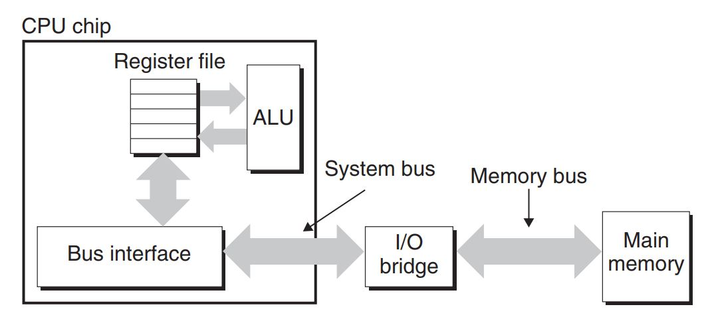

- the CPU chip, a chipset that we will call an I/O bridge (which includes the memory controller),
- the DRAM memory modules that make up main memory.
- These components are connected by a pair of buses:
  - a **system bus** that connects the CPU to the I/O bridge, and
  - a **memory bus** that connects the I/O bridge to the main memory.
- The **I/O bridge translates the electrical signals of the system bus into the electrical signals of the memory bus**.
  - The I/O bridge also **connects the system bus and memory bus to an I/O bus that is shared by I/O devices such as disks and graphics cards**.
-  Consider what happens when the CPU performs a load operation such as

```cpp
// the contents of address A are loaded into register %rax.
movq A,%rax
```

- Circuitry on the CPU chip called the **bus interface** initiates a read transaction on the bus. The read transaction consists of three steps.

- First, the CPU places the address A on the system bus.
- The I/O bridge passes the signal along to the memory bus (Figure 6.7(a)).
- Next, the main memory senses the address signal on the memory bus, reads the address from the memory bus, fetches the data from the DRAM, and writes the data to the memory bus.
- The I/O bridge translates the memory bus signal into a system bus signal and passes it along to the system bus (Figure 6.7(b)).
- Finally, the CPU senses the data on the system bus, reads the data from the bus, and copies the data to register %rax (Figure 6.7(c)).

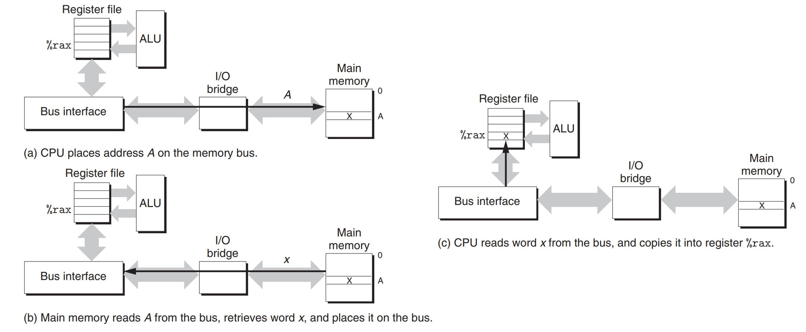

- Conversely, when the CPU performs a store operation such as where the contents of register `%rax` are written to address `A`:

```cpp
movq %rax,
```

- the CPU initiates a write transaction. Again, there are three basic steps.
  - First, the CPU places the address on the system bus. The memory reads the address from the memory bus and waits for the data to arrive (Figure 6.8(a)).
  - Next, the CPU copies the data in `%rax` to the system bus (Figure 6.8(b)).
  - Finally, the main memory reads the data from the memory bus and stores the bits in the DRAM (Figure 6.8(c))

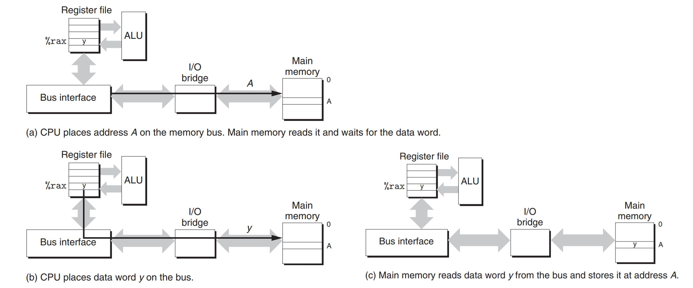


## Connecting I/O Devices

- Input/output (I/O) devices such as graphics cards, monitors, mice, keyboards, and disks are connected to the CPU and main memory **using an I/O bus.**
- Unlike the system bus and memory buses, which are CPU-specific, I/O buses are designed to be independent of the underlying CPU.

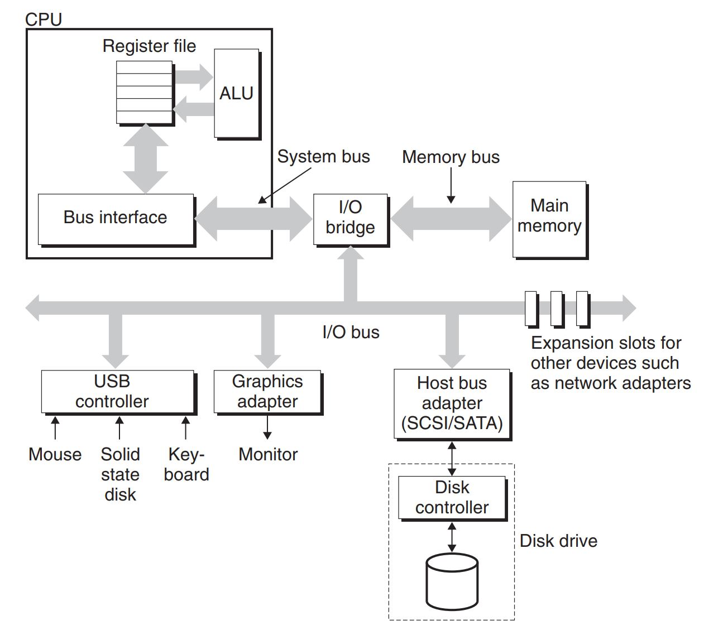

- Figure shows a representative I/O bus structure that connects the CPU, main memory, and I/O devices. Although the I/O bus is slower than the system and memory buses, it can accommodate a wide variety of third-party I/O devices.
- For example, the bus in Figure has three different types of devices attached to it.
- A Universal Serial Bus (USB) controller is a conduit for devices attached to a USB bus, which is a wildly popular standard for connecting a variety of peripheral I/O devices, including keyboards, mice, modems, digital cameras, game controllers, printers, external disk drives, and solid state disks.
- A graphics card (or adapter) contains hardware and software logic that is responsible for painting the pixels on the display monitor on behalf of the CPU.
- A host bus adapter that connects one or more disks to the I/O bus using a communication protocol defined by a particular host bus interface.
- Additional devices such as **network adapter**s can be attached to the I/O bus by plugging the adapter into empty expansion slots on the motherboard that provide a direct electrical connection to the bus.


## Storage Technology Trends

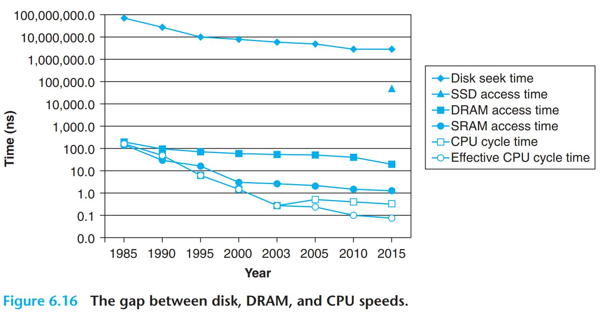

## Locality

Well-written computer programs tend to exhibit good locality. That is, **they tend to reference data items that are near other recently referenced data items or that were recently referenced themselves.**

- This tendency, known as the principle of locality, is an enduring concept that has enormous impact on the design and performance of hardware and software systems.

- Locality is typically described as having two distinct forms: **temporal locality and spatial locality**.

- In a program with good **temporal** locality, a memory location that is referenced once is likely to be **referenced again multiple times in the near future**.
- In a program with good **spatial locality**, if a memory location is referenced once, then the program is **likely to reference a nearby memory location in the near future.**


All levels of modern computer systems, from the hardware, to the operating system, to application programs, are designed to exploit locality.

- At the hardware level, the principle of locality allows computer designers to speed up main memory accesses by **introducing small fast memories known as cache memories that hold blocks of the most recently referenced instructions and data items**.
- At the operating system level, the principle of locality
  - **allows the system to use the main memory as a cache of the most recently referenced chunks of the virtual address space.**
  - Similarly, the operating system uses main memory to cache the most recently used disk blocks in the disk file system.
- The principle of locality also plays a crucial role in the design of application programs.
  - For example, Web browsers exploit temporal locality by caching recently referenced documents on a local disk.
  - High-volume Web servers hold recently requested documents in front-end disk caches that satisfy requests for these documents without requiring any intervention from the server.

## Locality of References to Program Data

- Consider the simple function:

```cpp
int sumvec(const std::vector<int>) {
  int sum = 0;
  for (int i = 0; i < v.size(); ++i) {
    sum += v[i];
  }
  return sum;
}
```

- Does this function have good locality?
  - The `sum` variable is referenced once in each loop iteration, and thus there is good temporal locality with respect to `sum`. On the other hand, since `sum` is a scalar, there is no spatial locality with respect to `sum`.
  - The elements of vector `v` are read sequentially, one after the other, in the order they are stored in memory. Thus, with respect to variable `v`, the function has good spatial locality but poor temporal locality since each vector element is accessed exactly once. Since the function has either good spatial or temporal locality with respect to each variable in the loop body, we can conclude that the function enjoys good locality.
- A function such as this one that visits each element of a vector sequentially is said to have a **stride-1 reference pattern** (with respect to the element size).
  - We will sometimes refer to stride-1 reference patterns as **sequential reference patterns.**
  - Visiting **every kth** element of a contiguous vector is called a **stride-k reference pattern**.
  - Stride-1 reference patterns are a common and important source of spatial locality in programs.
- In general, **as the stride increases, the spatial locality decreases.**
- Stride is also an important issue for programs that reference multidimensional arrays.

```cpp
int sum2dVec(const std::vector<std::vector<int>>& d2vec) {
  int sum = 0;
  int m = d2vec.size();
  int n = d2vec.front().size()
  for (int i = 0; i < m; ++i) {
    for (int j = 0; j < n; ++j) {
      sum += d2vec[i][j];
    }
  }
  return sum;
}
```

- It enjoys good spatial locality because
  - it references the array in the same row-major order that the array is stored.
  - The result is a nice stride-1 reference pattern with excellent spatial locality.
- Seemingly trivial changes to a program can have a big impact on its locality though:

```cpp
int sum2dVecBad(const std::vector<std::vector<int>>& d2vec) {
  int sum = 0;
  int m = d2vec.size();
  int n = d2vec.front().size()

  for (int j = 0; j < n; ++j) { // now we access col idx first
    for (int i = 0; i < m; ++i) {
      sum += d2vec[i][j];
    }
  }
  return sum;
}
```

- `sum2dVecBad` suffers from poor spatial locality because it scans the array column-wise instead of row-wise. Since C arrays are laid out in memory row-wise, the result is a stride-N reference pattern.

## Locality of Instruction Fetches

- Since program instructions are stored in memory and must be fetched (read) by the CPU, we can also evaluate the locality of a program with respect to its instruction fetches.
- An important property of code that distinguishes it from program data is that it is rarely modified at run time. While a program is executing, the CPU reads its instructions from memory. The CPU rarely overwrites or modifies these instructions.

## The memory hierarchy

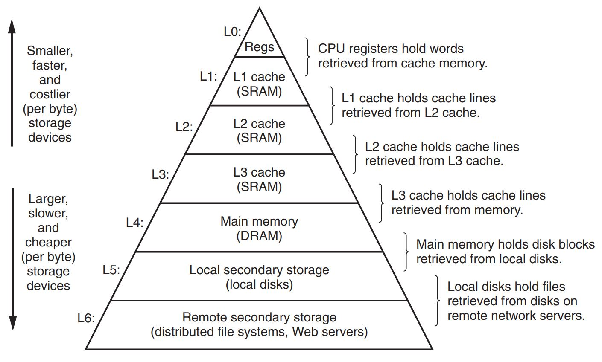

Fundamental properties of hardware and software complement each other beautifully. Their complementary nature suggests an approach for organizing memory systems, known as the memory hierarchy, that is used in all modern computer systems.

- Storage hardware technology: Different storage technologies have widely different access times. Faster technologies cost more per byte than slower ones and have less capacity. The gap between CPU and main memory speed is widening.
- Computer software. Well-written programs tend to exhibit good locality.

In general, the storage devices get slower, cheaper, and larger as we move from higher to lower levels.

- At the highest level (L0) are a small number of fast CPU registers that the CPU can access in a single clock cycle.
- Next are one or more small to moderate-size SRAM-based cache memories that can be accessed in a few CPU clock cycles.
- These are followed by a large DRAM-based main memory that can be accessed in tens to hundreds of clock cycles.
- Next are slow but enormous local disks.
- Finally, some systems even include an additional level of disks on remote servers that can be accessed over a network.

## Caching in the Memory Hierarchy

The general concept of caching in a memory hierarchy:

- storage at level k + 1 is partitioned into contiguous chunks of data objects called blocks. Each block has a unique address or name that distinguishes it from other blocks.
- Blocks can be either fixed size (the usual case) or variable size (e.g., the remote HTML files stored on Web servers).
- Similarly, the storage at level k is partitioned into a smaller set of blocks that are **the same size** as the blocks at level k + 1.
- At any point in time, **the cache at level k contains copies of a subset of the blocks from level k + 1**. Data are always copied back and forth between level k and level k + 1 in block-size transfer units.
- It is important to realize that **while the block size is fixed between any particular pair of adjacent levels in the hierarchy, other pairs of levels can have different block sizes**.
  - transfers between L1 and L0 typically use word-size blocks.
  - Transfers between L2 and L1 (and L3 and L2, and L4 and L3) typically use blocks of tens of bytes.
  - And transfers between L5 and L4 use blocks with hundreds or thousands of bytes.
- In general, **devices lower in the hierarchy (further from the CPU) have longer access times, and thus tend to use larger block sizes in order to amortize these longer access times.**

In summary, memory hierarchies based on caching work because slower storage is cheaper than faster storage and because programs tend to exhibit locality:

- **Exploiting temporal locality**.
  - Because of temporal locality, the same data objects are likely to be reused multiple times.
  - Once a data object has been copied into the cache on the first miss, we can expect a number of subsequent hits on that object.
  - Since the cache is faster than the storage at the next lower level, these subsequent hits can be served much faster than the original miss.
- **Exploiting spatial locality.**
  - Blocks usually contain multiple data objects.
  - Because of spatial locality, we can expect that the cost of copying a block after a miss **will be amortized by subsequent references to other objects within that block**

## Cache hits

When a program needs a particular data object d from level k + 1, it first looks for d in one of the blocks currently stored at level k.

- If d happens to be cached at level k, then we have what is called a **cache hit**.
- The program reads d directly from level k, which by the nature of the memory hierarchy is faster than reading d from level k + 1.


## Cache misses

If, on the other hand, the data object d is not cached at level k, then we have what is called a **cache miss**.

- When there is a miss, the cache at level k fetches the block containing d from the cache at level k + 1, possibly overwriting an existing block if the level k cache is already full.
  - This process of **overwriting an existing block is known as replacing or evicting the block**.
  - The block that is evicted is sometimes referred to as a **victim block**.
  - The decision about which block to replace is governed by the cache’s **replacement policy**.
- For example, a cache with a random replacement policy would choose a random victim block. A cache with a least recently used (LRU) replacement policy would choose the block that was last accessed the furthest in the past.
- After the cache at level k has fetched the block from level k + 1, the program can read d from level k as before.

## Kinds of Cache Misses


- If the cache at level k is empty, then any access of any data object will miss. 
- An empty cache is sometimes referred to as a **cold cache,** and misses of this kind are called **compulsory misses** or **cold misses**.
- Cold misses are important because they are often **transient events** that might not occur in steady state, after the cache has been **warmed up** by repeated memory accesses.
- Whenever there is a miss, the cache at level k must implement some placement policy that determines where to place the block it has retrieved from level k + 1.

---

The most flexible placement policy is to allow any block from level k + 1 to be stored in any block at level k.

- For caches high in the memory hierarchy (close to the CPU) that are implemented in hardware and where speed is at a premium, this policy is usually too expensive to implement because randomly placed blocks are expensive to locate.

- Thus, hardware caches typically implement a simpler placement policy that restricts a particular block at level k + 1 to a small subset (sometimes a singleton) of the blocks at level k.

- For example, we might decide that a block i at level k + 1 must be placed in block (i mod 4) at level k. For example, blocks 0, 4, 8, and 12 at level k + 1 would map to block 0 at level k; blocks 1, 5, 9, and 13 would map to block 1; and so on.

Restrictive placement policies of this kind lead to a type of miss known as a **conflict miss**, in which the c**ache is large enough to hold the referenced data objects, but because they map to the same cache block, the cache keeps missing.**

- For example, if the program requests block 0, then block 8, then block 0, then block 8, and so on, each of the references to these two blocks would miss in the cache at level k, even though this cache can hold a total of four blocks.

---

Programs often run as a sequence of phases (e.g., loops) where each phase accesses some reasonably constant set of cache blocks.

- For example, a nested loop might access the elements of the same array over and over again. This set of blocks is called **the working set of the phase**.
- When the size of the working set exceeds the size of the cache, the cache will experience what are known as **capacity misses**. In other words, the cache is just too small to handle this particular working set.

## Cache Management

- The essence of the memory hierarchy is that the storage device at each level is a cache for the next lower level.
- At each level, some form of logic must manage the cache. By this we mean that
  - something has to partition the cache storage into blocks,
  - transfer blocks between different levels,
  - decide when there are hits and misses, and then deal with them.

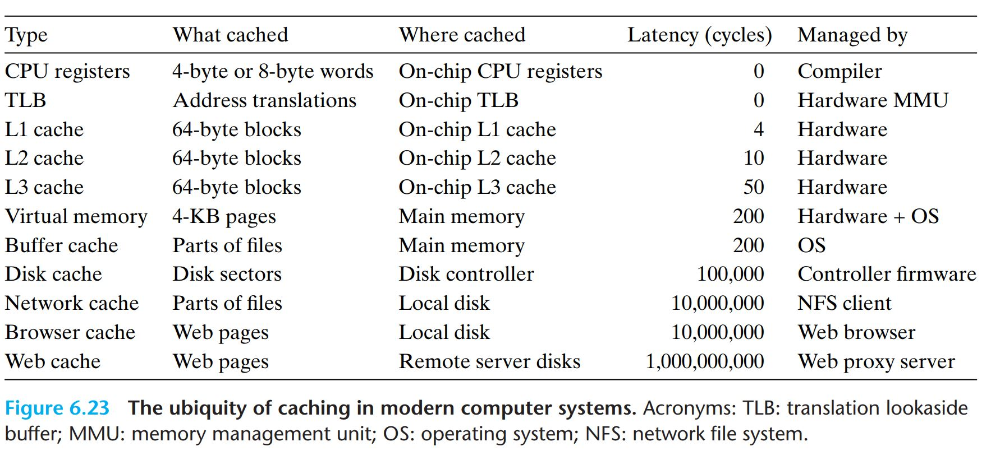

- The logic that manages the cache can be hardware, software, or a combination of the two.
  - For example, the **compiler manages the register file**, the highest level of the cache hierarchy. It decides when to issue loads when there are misses, and determines which register to store the data in.
  - The caches at levels **L1, L2, and L3 are managed entirely by hardware logic** built into the caches.
  - In a system with virtual memory, the DRAM main memory serves as a cache for data blocks stored on disk, and is managed by **a combination of operating system software and address translation hardware on the CPU**.
  - For a machine with a distributed file system such as AFS, the local disk serves as a cache that is managed by the **AFS client process** running on the local machine.
- In most cases, caches operate automatically and do not require any specific or explicit actions from the program.

## Generic Cache Memory Organization

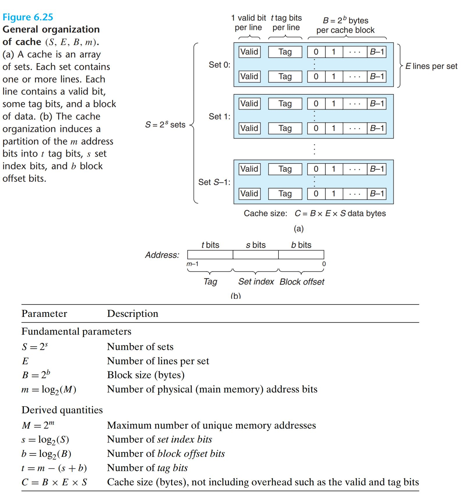

Consider a computer system where each memory address has $m$ bits that form $M = 2^m$ unique addresses.

- A cache for such a machine is organized as an array of $S = 2^s$ cache sets.
- Each set consists of $E$ cache lines.
- Each line consists of a data block of $B = 2^b$ bytes, a valid bit that indicates whether or not the line contains meaningful information, and $t = m − (b + s)$ tag bits (a subset of the bits from the current block’s memory address) that uniquely identify the block stored in the cache line.
- In general, a cache’s organization can be characterized by the tuple `(S, E, B, m)`.
  - The size (or capacity) of a cache, $C$, is stated in terms of the aggregate size of all the blocks. The tag bits and valid bit are not included. Thus, $C = S × E × B$.

When the CPU is instructed by a load instruction to read a word from address A of main memory, it sends address A to the cache. If the cache is holding a copy of the word at address A, it sends the word immediately back to the CPU.

- So how does the cache know whether it contains a copy of the word at address A? - The cache is organized so that it can find the requested word by simply **inspecting the bits of the address**, similar to a hash table with an extremely simple hash function.
- Here is how it works: The parameters $S$ and $B$ induce a partitioning of the m address bits into the three fields shown in Figure 6.25(b).
- The $s$ set index bits in A form an index into the array of $S$ sets. The first set is set 0, the second set is set 1, and so on.
- When interpreted as an unsigned integer, the **set index bits tell us which set the word must be stored in.**
- Once we know which set the word must be contained in, the $t$ tag bits in A tell us **which line** (if any) in the set contains the word.
- **A line in the set contains the word if and only if the valid bit is set and the tag bits in the line match the tag bits in the address A.**
- Once we have located the line identified by the tag in the set identified by the set index, then the $b$ block offset bits give us the offset of the word in the B-byte data block.


## Direct-Mapped Caches

- Caches are grouped into different classes based on E, the number of cache lines per set.
- A cache with **exactly one line per set** ($E = 1$) is known as a **direct-mapped cache**


- Suppose we have a system with a CPU, a register file, an L1 cache, and a main memory. When the CPU executes an instruction that reads a memory word `w` ...
  - it requests the word from the L1 cache.
  - If the L1 cache has a cached copy of `w`, then we have an L1 cache hit, and the cache quickly extracts `w` and returns it to the CPU.
  - Otherwise, we have a cache miss, and the CPU must wait while the L1 cache requests a copy of the block containing `w` from the main memory
  - When the requested block finally arrives from memory, the L1 cache stores the block in one of its cache lines, extracts word `w` from the stored block, and returns it to the CPU


The process that a cache goes through of determining whether a request is a
hit or a miss and then extracting the requested word consists of three steps: **(1) set selection, (2) line matching, and (3) word extraction.**


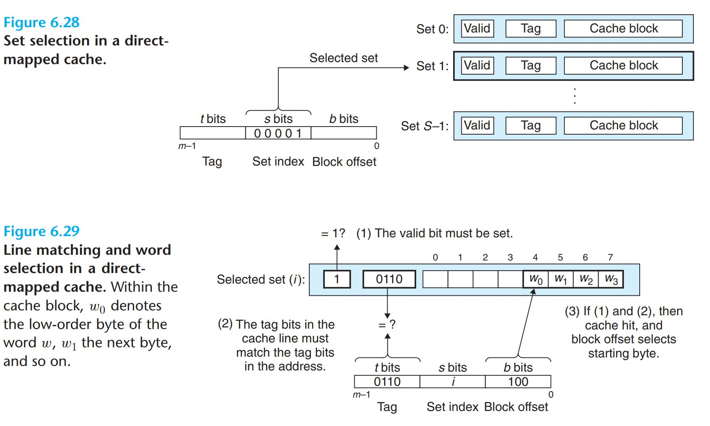

**Set Selection in Direct-Mapped Caches**

- In this step, the cache extracts the s set index bits from the middle of the address for `w`. These bits are interpreted as an unsigned integer that corresponds to a set number.
- In other words, if we think of the cache as a one-dimensional array of sets, then the set index bits form an index into this array.
- In this example, the set index bits `00001` are interpreted as an integer index that selects set 1.

**Line Matching in Direct-Mapped Caches**

- Now that we have selected some set `i` in the previous step, the next step is to determine if a copy of the word `w` is stored in one of the cache lines contained in set `i`.
- In a direct-mapped cache, this is easy and fast because there is exactly one line per set. A copy of `w` is contained in the line if and only if the valid bit is set and the tag in the cache line matches the tag in the address of w.
- In the example, since the tag bits in the cache line match the tag bits in the address, we know that a copy of the word we want is indeed stored in the line. In other words, we have a cache hit.
- On the other hand, if either the valid bit were not set or the tags did not match, \then we would have had a cache miss.


**Word Selection in Direct-Mapped Caches**

- Once we have a hit, we know that `w` is somewhere in the block.
- The block offset bits provide us with the offset of the first byte in the desired word.
- Similar to our view of a cache as an array of lines, we can think of a block as an array of bytes, and the byte offset as an index into that array.
- In the example, the block offset bits of `100` indicate that the copy of `w` starts at byte 4 in the block. (We are assuming that words are 4 bytes long.)

**Line Replacement on Misses in Direct-Mapped Caches**

- If the cache misses, then it needs to retrieve the requested block from the next level in the memory hierarchy and store the new block in **one of the cache lines of the set indicated by the set index bits**.
- In general, if the set is full of valid cache lines, then one of the existing lines must be evicted.
- For a direct-mapped cache, where each set contains exactly one line, the replacement policy is trivial: the current line is replaced by the newly fetched line.

**Putting It Together: A Direct-Mapped Cache in Action**

- The mechanisms that a cache uses to select sets and identify lines are extremely simple. They have to be, because the hardware must perform them in a few nanoseconds.

- Suppose we have a direct-mapped cache described by $(S, E, B, m) = (4, 1, 2, 4)$
  - In other words, the cache has 4 sets, 1 line per set, 2 bytes per block, and 4bit addresses.
  - We will also assume that each word is a single byte.

- When you are first learning about caches, it can be very instructive to enumerate the entire address space and partition the bits for our 4-bit example.

- There are some interesting things to notice about this enumerated space:
  - The concatenation of the tag and index bits (first 3 bits == block number) uniquely identifies each block in memory.
  - For example, block 0 consists of addresses 0 and 1, block 1 consists of addresses 2 and 3, block 2 consists of addresses 4 and 5, and so on.
  - Since there are **eight memory blocks but only four cache sets**, **multiple blocks map to the same cache set** (i.e., they have the same set index). For example, blocks 0 and 4 both map to set 0, blocks 1 and 5 both map to set 1, and so on.
  - Blocks that map to the same cache set are uniquely identified by the tag. For example, block 0 has a tag bit of 0 while block 4 has a tag bit of 1, block 1 has a tag bit of 0 while block 5 has a tag bit of 1, and so on.


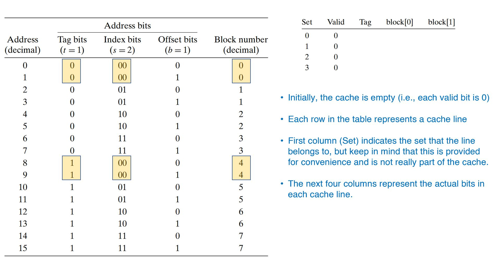

- Let us simulate the cache in action as the CPU performs a sequence of reads. Remember that for this example we are assuming that the CPU reads 1-byte words.

- Now, let’s see what happens when the CPU performs different operations:

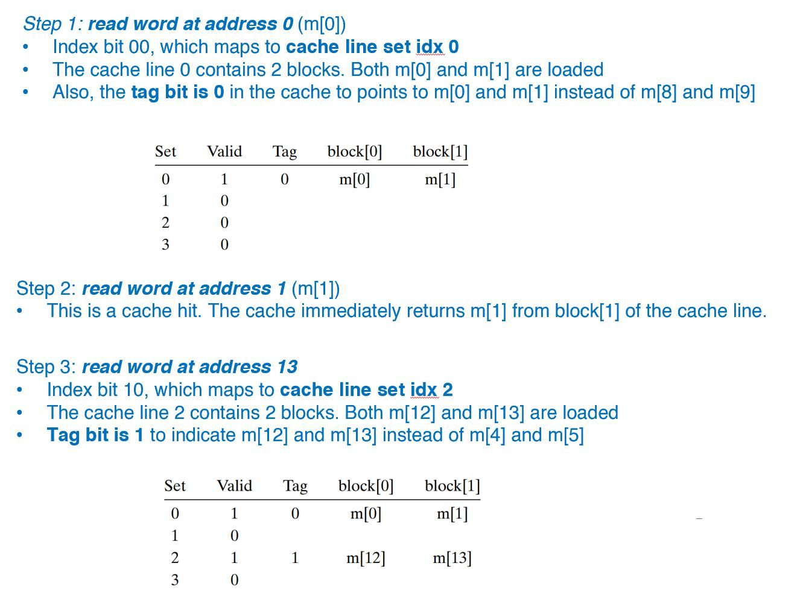
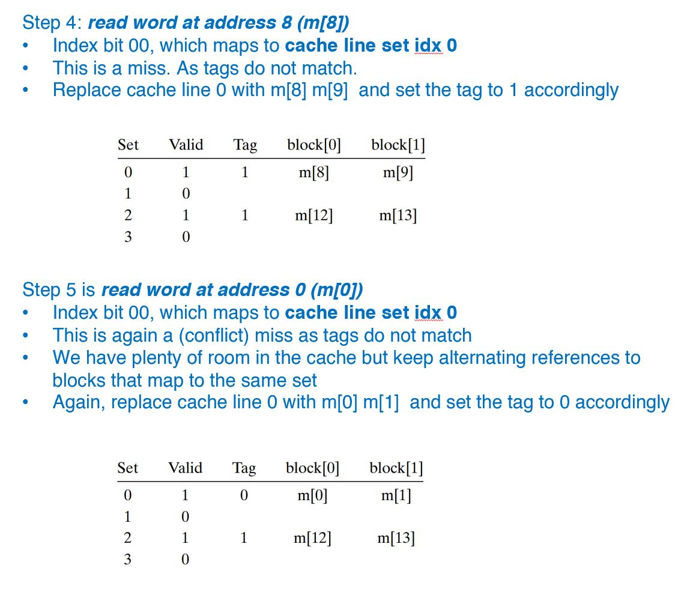

## Conflict Misses in Direct-Mapped Caches

> :bulb: Conflict misses in direct-mapped caches typically occur when programs access arrays whose sizes are a power of 2

- This function has good spatial locality with respect to x and y, and so we might expect it to enjoy a good number of cache hits. Unfortunately, this is not always true.


```cpp
float dotProd(const std::array<float, 8>& x,
              const std::array<float, 8>& y) {
  float sum = 0.0;
  for (int i = 0; i < 8; ++i) {
    sum += x[i] * y[i];
  }
  return sum;
}
```

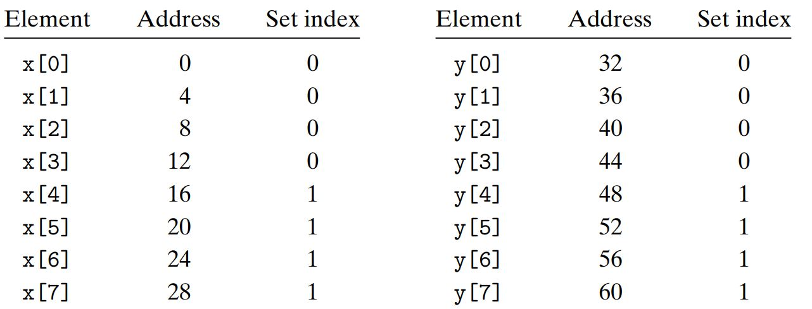

- Suppose that floats are 4 bytes, that x is loaded into the 32 bytes of contiguous memory starting at address 0, and that y starts immediately after x at address 32.
- For simplicity, suppose that a block is 16 bytes (big enough to hold four floats) and that the cache consists of two sets, for a total cache size of 32 bytes.
- We will assume that the variable sum is actually stored in a CPU register and thus does not require a memory reference.
- Given these assumptions, each x[i] and y[i] will map to the identical cache set: At run time, the first iteration of the loop references x[0], a miss that causes the block containing x[0]–x[3] to be loaded into set 0.
- The next reference is to y[0], another miss that causes the block containing y[0]–y[3] to be copied into set 0, overwriting the values of x that were copied in by the previous reference.
- During the next iteration, the reference to x[1] misses, which causes the x[0]– x[3] block to be loaded back into set 0, overwriting the y[0]–y[3] block.
- So now we have a conflict miss, and in fact each subsequent reference to x and y will result in a conflict miss as we thrash back and forth between blocks of x and y.

:bulb: The term ***thrashing*** describes any situation where a cache is repeatedly loading and evicting the same sets of cache blocks.

- Luckily, thrashing is easy for programmers to fix once they recognize what is going on. One easy solution is to put B bytes of padding at the end of each array

## Set Associative Caches

- The problem with conflict misses in direct-mapped caches stems from the constraint that each set has exactly one line (or in our terminology, $E = 1$).
- A **set associative cache** relaxes this constraint so that each set holds more than one cache line. A cache with $1 < E < \frac{C}{B}$ is often called an $E$-way set associative cache.

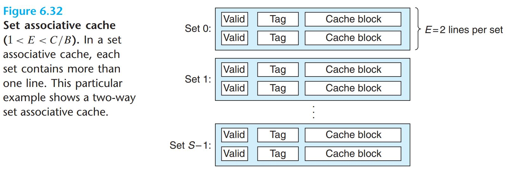

**Set Selection in Set Associative Caches**

- Set selection is identical to a direct-mapped cache, with the set index bits identifying the set.

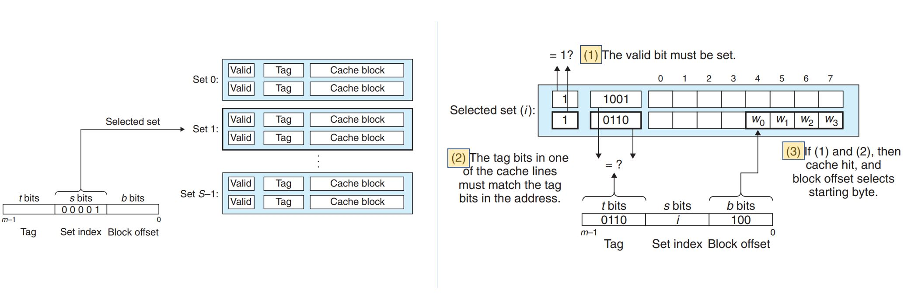

**Line Matching and Word Selection in Set Associative Caches**

- Line matching is more involved in a set associative cache than in a direct-mapped cache because it must **check the tags and valid bits of multiple lines** in order to determine if the requested word is in the set.

- We can think of each set in a set associative cache as a small associative memory where the **keys are the concatenation of the tag and valid bits**, and the **values are the contents of a block**.
  - An associative memory is an array of (key, value) pairs that takes as input the key and returns a value from one of the (key, value) pairs that matches the input key.

- An important idea here is that **any line in the set can contain any of the memory blocks that map to that set.** So **the cache must search each line in the set for a valid line whose tag matches the tag in the address.** If the cache finds such a line, then we have a hit and the block offset selects a word from the block, as before.

**Line Replacement on Misses in Set Associative Caches**

- If the word requested by the CPU is not stored in any of the lines in the set, then we have a cache miss, and the cache must fetch the block that contains the word from memory. However, once the cache has retrieved the block, which line should it replace?
- Of course, if there is an empty line, then it would be a good candidate. But if there are no empty lines in the set, then we must choose one of the nonempty lines and hope that the CPU does not reference the replaced line anytime soon.
  - It is very difficult for programmers to exploit knowledge of the cache replacement policy in their codes, so we will not go into much detail about it here.
- The simplest replacement policy is to choose the line to replace **at random**.
- Other more sophisticated policies draw on the principle of locality to **try to minimize the probability that the replaced line will be referenced in the near future.** For example
  - a **least frequently used (LFU)** policy will replace the line that has been referenced the fewest times over some past time window.
  - A **least recently used (LRU)** policy will replace the line that was last accessed the furthest in the past.
- All of these policies require additional time and hardware. But as we move further down the memory hierarchy, away from the CPU, the cost of a miss becomes more expensive and it becomes more worthwhile to minimize misses with good replacement policies.


## Fully Associative Caches

A fully associative cache consists of a single set (i.e., $E = C/B$) that contains **all of the cache lines**.

**Set Selection in Fully Associative Caches**

- Set selection in a fully associative cache is trivial because there is only one set.
- Notice that there are no set index bits in the address, which is partitioned into only a tag and a block offset.

**Line Matching and Word Selection in Fully Associative Caches**

- Line matching and word selection in a fully associative cache work the same as with a set associative cache.
- The difference is mainly a question of scale. Because the cache circuitry must search for many matching tags in parallel, it is difficult and expensive to build an associative cache that is both large and fast.
- As a result, fully associative caches are only appropriate for small caches, such as the **translation look aside buffers** (TLBs) in virtual memory systems that cache **page table entries**.

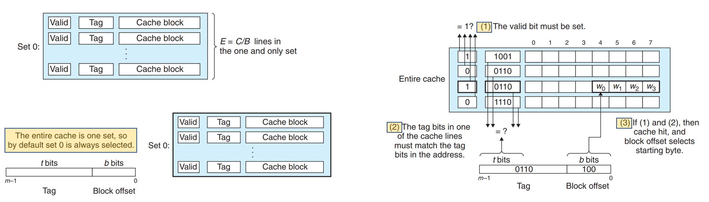

