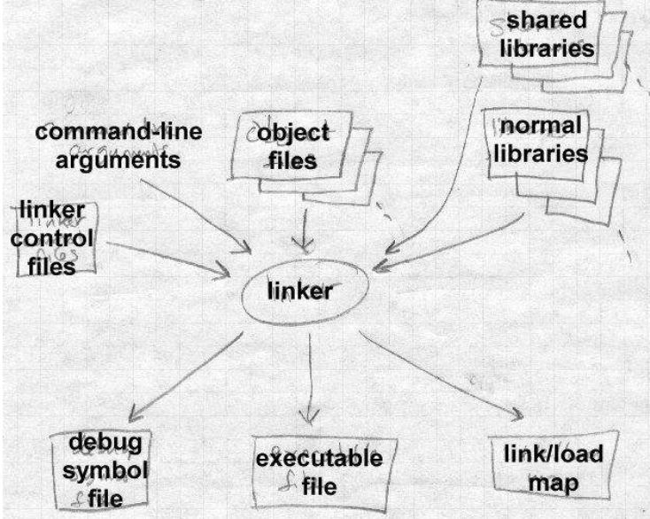
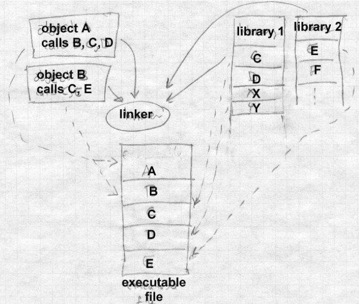

# [Chapter 1, Linking and Loading](ch1.linking_and_loading.md)

Linkers and loaders are essential components **in the process of translating and executing programs**. They perform distinct tasks but are closely related.

- The job of a linker or loader is to bind abstract names to concrete names.
  - It allows programmers to write code using abstract names.
  - Linkers or loaders associate a programmer's name, like "getline," with a specific location in memory.
  - They can also associate abstract numeric addresses with specific numeric addresses in memory.

Linkers and loaders have separate but related actions.

- Program loading involves copying a program from secondary storage (like a disk) into main memory.
  - Loading may also involve allocating storage, setting protection bits, and arranging virtual memory mappings.
- Relocation is the process of assigning load addresses to program parts and adjusting code and data accordingly.
  - Relocation allows multiple subprograms to be loaded at non-overlapping addresses.
- Symbol resolution is the process of resolving references from one subprogram to another using symbols.
  - Linkers resolve symbols by noting the location assigned to them and patching the object code accordingly.
- Linkers and loaders can perform relocation, symbol resolution, and program loading functions.
  - The line between relocation and symbol resolution can be blurred, and linkers can resolve symbol references.
- Linkers and loaders both patch object code, which is a unique and powerful feature. Incorrect patching can lead to difficult-to-debug issues.

Linking is a two-pass process performed by linkers.

- The linker takes input object files, libraries, and command files, and produces an output object file.
- In the first pass,
  - the linker scans input files to determine segment sizes and collect symbol definitions and references.
  - It creates a segment table and a symbol table based on the collected information.
- Using data from the first pass, the linker assigns numeric locations to symbols and determines segment sizes and locations in the output address space.
- The second pass uses the collected information to link the object code.
  - It reads and relocates the object code, substituting numeric addresses for symbol references and adjusting memory addresses.
  - The linker writes the relocated code to the output file, along with header information, relocated segments, and symbol table information.
- If dynamic linking is used, the symbol table contains information for resolving dynamic symbols at runtime.
- The output file may also contain a symbol table for relinking or debugging purposes.
- Some object formats support relinking, where the output file can be used as input for subsequent linker runs.
- Debugging symbols are present in most object formats, allowing the debugger to map program control based on source code line numbers and names.
- Debugging symbols may be included in the same symbol table as the linker symbols or in a separate table.
- Some linkers may appear to work in one pass by buffering input file contents during linking.
  - This buffering technique doesn't fundamentally change the two-pass nature of linking.

Linkers support object code libraries and shared libraries.

- Object code libraries are sets of object code files.
- If there are any undefined imported names after processing regular input files, the linker searches through the libraries.
- The linker links in any files from the library that export the undefined names.
- Some systems allow concatenating multiple object files to create a link library.

Relocation and code modification are crucial tasks performed by linkers and loaders.

- When a compiler or assembler generates an object file, it uses unrelocated addresses for code and data.
- The linker modifies the object code to reflect the actual assigned addresses during the linking process.
- The modification involves adjusting addresses and patching in the correct addresses for symbols.
- Instructions and data pointers in the object file need to be adjusted.
- Older computers with small address spaces have simpler modification processes.
- Modern computers, including RISC architectures, require more complex code modification due to limited bits for direct addresses.
- Linkers handle complicated addressing tricks, such as using multiple instructions to construct an address or using an address pool.
- Position independent code may be required in some systems, and linkers provide additional support for it.
- Linkers separate non-position independent parts and establish communication between them.

Compiler drivers

- Compiler drivers are responsible for automatically invoking the linker as part of the compilation process.
- The operation of the linker is often invisible to the programmer.
- Compiler drivers handle multiple phases of the compiler, such as preprocessing, compiling, and assembling.
- The driver performs these steps for each source file,
  - creating preprocessed files, assembler files, and object files.
- The linker is then invoked on the object files along with the system C library.
- Compiler drivers can be more advanced, utilizing techniques like comparing file creation dates to determine which files need recompilation.
- They can also work around limitations in linkers or object formats, especially when dealing with C++ and other object-oriented languages.
- Compiler drivers can perform tricks like selectively linking object files to identify needed routines and generating object code for necessary template routines.
- These tricks are used to optimize the compilation process and overcome language-specific challenges.

Linker command language

- Linkers have a command language to control the linking process.
- The command language allows specifying object files and libraries to link.
- Linkers offer various options such as keeping debugging symbols, using shared or unshared libraries, and choosing output formats.
- The linker command language can specify the binding address for the linked code.
- Multiple code and data segments can be controlled using the linker command language.
- There are four common techniques to pass commands to a linker:
  - Command line: File names and switches are passed through the command line or an equivalent interface.
  - Intermixed with object files: Some linkers accept object files and linker commands in a single input file.
  - Embedded in object files: Certain object formats, like Microsoft's, allow embedding linker commands within object files.
  - Separate configuration language: Some linkers have a dedicated configuration language for controlling linking, such as the GNU linker with its complex control language.
- The GNU linker, for example, supports specifying the linking order of segments, rules for combining similar segments, segment addresses, and other options.
- Other linkers may have simpler languages tailored for specific features, like programmer-defined overlays.

Separating a linker and loader into separate programs offers several advantages:

1. **Modularity and Flexibility**: Separation allows independent development and maintenance of the linker and loader. Each component can be optimized and updated separately, providing flexibility in their functionality and performance.

2. **Reuse**: Separation enables the reuse of the linker for different loading scenarios. Different loaders can be built on top of the linker, allowing the same linking process to be used with different loading strategies.

3. **Efficiency**: A separate linker and loader can be optimized individually to perform their specific tasks efficiently. The linker focuses on symbol resolution, relocation, and generating the final executable, while the loader focuses on memory allocation, relocation, and setting up the execution environment.

4. **Incremental Loading**: Separation allows for incremental loading, where parts of the program can be loaded into memory as needed, reducing the initial loading time and memory requirements.

However, there are circumstances where a combined linking loader can be useful:

1. **Embedded Systems**: In resource-constrained embedded systems, where memory and processing power are limited, combining the linker and loader into a single program can reduce the overall system footprint.

2. **Small-scale Applications**: For small-scale applications with straightforward loading requirements and limited complexity, a combined linking loader can simplify the development and deployment process.

3. **Static Linking**: In scenarios where static linking is preferred or required, combining the linker and loader simplifies the process by directly producing a self-contained executable.

4. **Single-Task Systems**: In systems that perform a single task without the need for dynamic loading or unloading of modules, a combined linking loader can provide a straightforward and efficient solution.

In summary, separating the linker and loader offers modularity, flexibility, and optimized performance, while a combined linking loader can be advantageous in certain resource-constrained or simple application scenarios.

## Summary

The key takeaways from the discussion about linkers and loaders are as follows:

1. **Linkers** are programs that take object files and libraries as input and generate an executable or shared library as output. They resolve symbols, perform relocations, and arrange code and data in the final executable.

2. **Loaders** are programs that load the executable into memory, perform additional relocations, allocate memory, and set up the execution environment. They prepare the program for execution by resolving dynamic symbols and initializing variables.

3. Linking is a **two-pass process** where the linker scans input files, collects symbol information, assigns numeric locations to symbols, determines segment sizes, and generates relocated code. The second pass performs the actual linking, substituting addresses and adjusting memory addresses.

4. **Object code libraries** are sets of object code files that linkers can use to resolve undefined symbols. Linkers search libraries and link in the necessary files to resolve any remaining undefined symbols.

5. **Relocation and code modification** is a crucial part of the linking process. Linkers modify object code to reflect the actual addresses assigned during the linking process. This includes adjusting addresses in instructions and data to match the final memory layout.

6. **Compiler drivers** automate the compilation and linking process. They invoke the compiler, assembler, and linker sequentially, handling dependencies and recompiling only the necessary source files.

7. **Linker command languages** provide a way to control the linking process. Command line options, intermixing commands with object files, embedding commands in object files, or using a separate configuration language are common approaches.

8. Separating the **linker and loader into separate programs** offers modularity, flexibility, and optimized performance. It allows for independent development and reuse of components, incremental loading, and specific optimizations.

9. However, a **combined linking loader** can be useful in resource-constrained embedded systems, small-scale applications, static linking scenarios, or single-task systems where simplicity and reduced system footprint are prioritized.

Overall, linkers and loaders play crucial roles in the compilation and execution of programs, managing the resolution of symbols, code relocation, and memory allocation to create executable programs from object files.