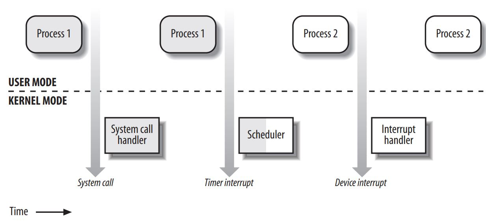

# Ch 1. Introduction

## Linux Versus Other Unix-Like Kernels

- Linux is a member of the large family of Unix-like operating systems.
- One of the more appealing benefits to Linux is that it isn’t a commercial operating system
- Technically speaking, Linux is a true Unix kernel, although it is not a full Unix operating system because it does not include all the Unix applications, such as filesystem utilities, windowing systems and graphical desktops, system administrator commands, text editors, compilers, and so on.
  - However, because most of these programs are freely available under the GPL, they can be installed in every Linux-based system
- The current standards specify only an application programming interface (API)— that is, a well-defined environment in which user programs should run. Therefore, **the standards do not impose any restriction on internal design choices of a compliant kernel.**
- To define a common user interface, Unix-like kernels often share fundamental design ideas and features. In this respect, Linux is comparable with the other Unix-like operating systems.
- Linux doesn’t stick to any particular variant. Instead, it tries to adopt the best features and design choices of several different Unix kernels.
- The following list describes how Linux competes against some well-known commercial Unix kernels:

**Monolithic kernel**

- It is a large, complex do-it-yourself program, composed of several logically different components. In this, it is quite conventional; most commercial Unix variants are monolithic.
  - (Notable exceptions are the Apple Mac OS X)

**Compiled and statically linked traditional Unix kernels**

- Most modern kernels can **dynamically load and unload some portions of the kernel code** (typically, device drivers), which are usually called **modules**.
- Linux’s support for modules is very good, because it is able to automatically load and unload modules on demand.

**Kernel threading**

- Some Unix kernels, such as Solaris and SVR4.2/MP, are organized as **a set of kernel threads**.
  - A **kernel thread** is an **execution context** that can be independently scheduled;
  - it **may be associated with a user program, or it may run only some kernel functions.**
- **Context switches between kernel threads are usually much less expensive than context switches between ordinary processes**, because the former usually **operate on a common address space**.
- Linux uses kernel threads in a very limited way to **execute a few kernel functions periodically**; however, they do not represent the basic execution context abstraction. (That’s the topic of the next item.)

**Multithreaded application support**

- Most modern operating systems have some kind of support for multithreaded applications—that is, user programs that are designed in terms of **many relatively independent execution flows that share a large portion of the application data structures.**
- A multithreaded user application could be composed of many **lightweight processes (LWP)**, which are **processes that can operate on a common address space, common physical memory pages, common opened files, and so on**.
- Linux defines its own version of lightweight processes, which is different from the types used on other systems such as SVR4 and Solaris.
- While all the commercial Unix variants of LWPare based on kernel threads, **Linux regards lightweight processes as the basic execution context and handles them via the nonstandard `clone()` system call**

**Preemptive kernel**

- A preemptible kernel is a kernel configuration that allows for better responsiveness and lower latency **by enabling the kernel to be preempted or interrupted during its execution.**
  - This means that higher-priority tasks, such as user-space applications or time-sensitive tasks, can take over the CPU more quickly when needed, instead of waiting for the kernel to complete its current operation
- When compiled with the “Preemptible Kernel” option, Linux 2.6 can **arbitrarily interleave execution flows while they are in privileged mode.**

- Besides Linux 2.6, a few other conventional, general-purpose Unix systems, such as Solaris and Mach 3.0, are fully preemptive kernels.
- SVR4.2/MPintroduces some fixed preemption points as a method to get limited preemption capability.

**Multiprocessor support**

- Several Unix kernel variants take advantage of multiprocessor systems.
- Linux 2.6 supports **symmetric multiprocessing (SMP)** for different memory models, including **NUMA**: **the system can use multiple processors and each processor can handle any task**—there is no discrimination among them.
  - **NUMA (Non-Uniform Memory Access)** is a memory architecture used in multiprocessor systems to improve performance and scalability.
  - It divides memory into multiple nodes, each associated with a specific processor.
  - This allows faster access to local memory, reduces resource contention, and enhances the system's ability to scale with a larger number of processors.
- Although a few parts of the kernel code are still serialized by means of a single “big kernel lock,” it is fair to say that Linux 2.6 makes a near optimal use of SMP.

**Filesystem**

- Linux’s standard filesystems come in many flavors.
  - You can use the plain old Ext2 filesystem if you don’t have specific needs.
  - You might switch to Ext3 if you want to avoid lengthy filesystem checks after a system crash.
  - If you’ll have to deal with many small files, the ReiserFS filesystem is likely to be the best choice.
  - Besides Ext3 and ReiserFS, several other journaling filesystems can be used in Linux; they include IBM AIX’s Journaling File System (JFS) and Silicon Graphics IRIX’s XFS filesystem.
- Thanks to a powerful object-oriented **Virtual File System** technology (inspired by Solaris and SVR4), **porting a foreign filesystem to Linux is generally easier than porting to other kernels.**

**STREAMS**

- STREAMS I/O is a modular framework for implementing character-based I/O drivers, introduced in the UNIX System V Release 4 (SVR4).
- Linux, however, chose not to adopt STREAMS and instead developed its own networking and I/O subsystems, which focus on performance, efficiency, and modularity.

This assessment suggests that Linux is fully competitive nowadays with commercial operating systems. Moreover, Linux has several features that make it an exciting operating system.

- Commercial Unix kernels often introduce new features to gain a larger slice of the market, but these features are not necessarily useful, stable, or productive.
- By contrast, Linux—together with the other open source operating systems—doesn’t suffer from the restrictions and the conditioning imposed by the market, hence it can freely evolve according to the ideas of its designers (mainly Linus Torvalds).

Specifically, Linux offers the following advantages over its commercial competitors:

- Linux is cost-free. You can install a complete Unix system at no expense other than the hardware (of course).
- Linux is fully customizable in all its components. Thanks to the compilation options, you can customize the kernel by selecting only the features really needed.
- Moreover, thanks to the GPL, you are allowed to freely read and modify the source code of the kernel and of all system programs.
- Linux runs on low-end, inexpensive hardware platforms. You are able to build a network server using an old Intel 80386 system with 4 MB of RAM.
- Linux is powerful. Linux systems are very fast, because they fully exploit the features of the hardware components.
- **The main Linux goal is efficiency** and indeed many design choices of commercial variants, like the STREAMS I/O subsystem, have been rejected by Linus because of their implied performance penalty.
- Linux systems are very stable; they have a very low failure rate and system maintenance time.
- **The Linux kernel can be very small and compact**. It is possible to fit a kernel image, including a few system programs, on just one 1.44 MB floppy disk.
- Linux is highly compatible with many common operating systems.
  - Linux lets you directly mount filesystems for all versions of MS-DOS and Microsoft Windows, SVR4, OS/2, Mac OS X, Solaris, SunOS, NEXTSTEP, many BSD variants, and so on.
- Linux also is able to operate with many network layers, such as
  - Ethernet (as well as Fast Ethernet, Gigabit Ethernet, and 10 Gigabit Ethernet),
  - Fiber Distributed Data Interface (FDDI),
  - High Performance Parallel Interface (HIPPI),
  - IEEE 802.11 (Wireless LAN), and
  - IEEE 802.15 (Bluetooth).
- By using suitable libraries, Linux systems are even able to directly run programs written for other operating systems.
- Linux is well supported.
  - It may be a lot easier to get patches and updates for Linux than for any proprietary operating system.
  - The answer to a problem often comes back within a few hours after sending a message to some newsgroup or mailing list. Moreover, drivers for Linux are usually available a few weeks after new hardware products have been introduced on the market.
  - By contrast, hardware manufacturers release device drivers for only a few commercial operating systems—usually Microsoft’s.

## Hardware Dependency

- Linux tries to maintain a neat distinction between hardware-dependent and hardware-independent source code.
- To that end, both the `arch` and the `include` directories include 23 subdirectories that correspond to the different types of hardware platforms supported.
- For example:
  - `x86_64`: Workstations based on the AMD’s 64-bit microprocessors—such Athlon and Opteron—and Intel’s ia32e/EM64T 64-bit microprocessors
  - `i386`: IBM-compatible personal computers based on 80x86 microprocessors
  - `ia64`: Workstations based on the Intel 64-bit Itanium microprocessor

## Linux Versions

- For Linux kernel version >= 2.6, the second number no longer identifies stable or development versions.
- The new model of Linux development implies that two kernels having the same version but different release numbers—for instance, 2.6.10 and 2.6.11—can differ significantly even in core components and in fundamental algorithms.
- When a new kernel release appears, it is potentially unstable and buggy. To address this problem, the kernel developers may release patched versions of any kernel, which are identified by a fourth number in the version numbering scheme - like: `2.6.11.12`

## Basic Operating System Concepts

- Each computer system includes a basic set of programs called the **operating system**.
The most important program in the set is called the **kernel**. It is loaded into RAM when the system boots and contains many critical procedures that are needed for the system to operate.
  - The other programs are less crucial utilities; they can provide a wide variety of interactive experiences for the user—as well as doing all the jobs the user bought the computer for — but the essential shape and capabilities of the system are determined by the kernel.
- The kernel provides key facilities to everything else on the system and determines many of the characteristics of higher software. Hence, **we often use the term “operating system” as a synonym for “kernel.”**
- The operating system must fulfill two main objectives:
  - :one: **Interact with the hardware components**, servicing all low-level programmable elements included in the hardware platform.
  - :two: Provide an **execution environment** to the applications that run on the computer system (the so-called **user programs**).
- Some operating systems allow all user programs to directly play with the hardware components (a typical example is MS-DOS). In contrast, **a Unix-like operating system hides all low-level details concerning the physical organization of the computer from applications run by the user.**
- **When a program wants to use a hardware resource, it must issue a request to the operating system. The kernel evaluates the request and, if it chooses to grant the resource, interacts with the proper hardware components on behalf of the user program.**
  - To enforce this mechanism, modern operating systems rely on the availability of specific hardware features that forbid user programs to directly interact with low-level hardware components or to access arbitrary memory locations.
  - In particular, the hardware introduces at least two different execution modes for the CPU: a **non-privileged mode for user programs** and a **privileged mode for the kernel**.
  - Unix calls these **User Mode** and **Kernel Mode**, respectively.

### Multiuser Systems

- A multiuser system is **a computer that is able to concurrently and independently execute several applications belonging to two or more users.**
  - **Concurrently** means that applications can be active at the same time and contend for the various resources such as CPU, memory, hard disks, and so on.
  - **Independently** means that each application can perform its task with no concern for what the applications of the other users are doing.
- Switching from one application to another, of course, slows down each of them and affects the response time seen by the users.
- Many of the complexities of modern operating system kernels are present to minimize the delays enforced on each program and to provide the user with responses that are as fast as possible.
- Multiuser operating systems must include several features:
  - An authentication mechanism for verifying the user’s identity
  - A protection mechanism against buggy user programs that could block other applications running in the system
  - A protection mechanism against malicious user programs that could interfere with or spy on the activity of other users
  - An accounting mechanism that limits the amount of resource units assigned to each user
- To ensure safe protection mechanisms, operating systems must **use the hardware protection associated with the CPU privileged mode.** Otherwise, a user program would be able to directly access the system circuitry and overcome the imposed bounds.
- Unix is a multiuser system that enforces the hardware protection of system resources.

### Users and Groups

- In a multiuser system, **each user has a private space on the machine**; typically, he owns some quota of the disk space to store files, receives private mail messages, and so on.
- The **operating system must ensure that the private portion of a user space is visible only to its owner.** In particular, it must ensure that no user can exploit a system application for the purpose of violating the private space of another user.
- All users are identified by a unique number called the User ID, or **UID**. Usually only a restricted number of persons are allowed to make use of a computer system.
- When one of these users starts a working session, the system asks for a login name and a password. If the user does not input a valid pair, the system denies access. Because the password is assumed to be secret, the user’s privacy is ensured.
- To selectively share material with other users, **each user is a member of one or more user groups**, which are identified by a unique number called a **user group ID**.
- **Each file is associated with exactly one group**.
  - For example, access can be set so the user owning the file has read and write privileges, the group has read-only privileges, and other users on the system are denied access to the file.
- Any Unix-like operating system has a special user called root or superuser.
  - The system administrator must log in as root to handle user accounts, perform maintenance tasks such as system backups and program upgrades, and so on.
  - The root user can do almost everything, because the operating system does not apply the usual protection mechanisms to her. In particular, the root user can access every file on the system and can manipulate every running user program.

### Processes

- All operating systems use one fundamental abstraction: the process. A process can be defined **either as “an instance of a program in execution”** or as **the “execution context” of a running program**.
- In traditional operating systems, a process executes a single sequence of instructions in an **address space**; the address space is the **set of memory addresses that the process is allowed to reference**.
- Modern operating systems **allow processes with multiple execution flows**—that is, **multiple sequences of instructions executed in the same address space**.
- Multiuser systems must enforce an execution environment in which **several processes can be active concurrently and contend for system resources, mainly the CPU**.
- Systems that allow **concurrent active processes are said to be multiprogramming or multiprocessing**.
- It is important to distinguish **programs** from **processes**;
  - several processes can execute the same program concurrently, while
  - the same process can execute several programs sequentially.
  - On uniprocessor systems, just one process can hold the CPU, and hence just one execution flow can progress at a time.
  - In general, the number of CPUs is always restricted, and therefore only a few processes can progress at once.
- An operating system component called the **scheduler** chooses the process that can progress.
  - Some operating systems allow only 拗音, which means that the **scheduler is invoked only when a process voluntarily relinquishes the CPU**.
  - But **processes of a multiuser system must be preemptable; the operating system tracks how long each process holds the CPU and periodically activates the scheduler.** Unix is a multiprocessing operating system with preemptable processes.
- Even when no user is logged in and no application is running, several system processes monitor the peripheral devices. In particular, **several processes listen at the system terminals waiting for user logins**.
  - When a user inputs a login name, the listening process runs a program that validates the user password.
  - If the user identity is acknowledged, the process creates another process that runs a shell into which commands are entered.
  - When a graphical display is activated, one process runs the window manager, and each window on the display is usually run by a separate process.
  - When a user creates a graphics shell, one process runs the graphics windows and a second process runs the shell into which the user can enter the commands.
  - For each user command, the shell process creates another process that executes the corresponding program.
- Unix-like operating systems adopt a process/kernel model.
  - Each process **has the illusion that it’s the only process on the machine, and it has exclusive access to the operating system services.**
  - **Whenever a process makes a system call (i.e., a request to the kernel), the hardware changes the privilege mode from User Mode to Kernel Mode, and the process starts the execution of a kernel procedure with a strictly limited purpose.**
  - In this way, the operating system acts within the execution context of the process in order to satisfy its request. **Whenever the request is fully satisfied, the kernel procedure forces the hardware to return to User Mode and the process continues its execution from the instruction following the system call.**

### Kernel Architecture

- In operating systems, the **kernel** is the core component that manages system resources and provides services to other programs.
- A monolithic kernel is a type of kernel architecture in which **all kernel services run in the same address space, sharing the same memory and hardware resources.**
  - This means that **all kernel code and device drivers are loaded and executed in a single, unified kernel space.**
- In contrast, a microkernel architecture separates kernel services into individual, standalone processes, **each with its own address space, and uses inter-process communication mechanisms to provide services to other processes.**
  - microkernel operating systems demand a very small set of functions from the kernel, generally including a few synchronization primitives, a simple scheduler, and an interprocess communication mechanism. Several system processes that run on top of the microkernel implement other operating system–layer functions, like memory allocators, device drivers, and system call handlers.
  - Although academic research on operating systems is oriented toward microkernels, such operating systems are **generally slower than monolithic ones**, because the explicit message passing between the different layers of the operating system has a cost.
  - However, microkernel operating systems might have some **theoretical advantages** over monolithic ones.
    - Microkernels **force the system programmers to adopt a modularized approach**, because each operating system layer is a relatively independent program that must interact with the other layers through well-defined and clean software interfaces.
    - Moreover, an existing microkernel operating system can be **easily ported to other architectures fairly easily, because all hardware-dependent components are generally encapsulated in the microkernel code.**
    - Finally, microkernel operating systems tend to make better use of random access memory (RAM) than monolithic ones, because **system processes that aren’t implementing needed functionalities might be swapped out or destroyed.**

- As stated before, most Unix kernels are monolithic:
  - **each kernel layer is integrated into the whole kernel program and runs in Kernel Mode on behalf of the current process.**

## Linux modules

- To achieve many of the theoretical advantages of microkernels without introducing performance penalties, **the Linux kernel offers modules.**
- A **module** is an object file whose code **can be linked to (and unlinked from) the kernel at runtime.**
- The object code usually consists of a set of functions that implements a filesystem, a device driver, or other features at **the kernel’s upper layer**.
- The module, unlike the external layers of microkernel operating systems, does not run as a specific process. Instead, **it is executed in Kernel Mode on behalf of the current process, like any other statically linked kernel function.**
- The main advantages of using modules include:
  - **A modularized approach**:
    - Because any module can be linked and unlinked at runtime, **system programmers must introduce well-defined software interfaces to access the data structures handled by modules.** This makes it easy to develop new modules.
  - **Platform independence**:
    - Even if it may rely on some specific hardware features, **a module doesn’t depend on a fixed hardware platform.**
    - For example, a disk driver module that relies on the SCSI standard works as well on an IBM-compatible PC as it does on Hewlett-Packard’s Alpha.
  - **Frugal main memory usage**
    - **A module can be linked to the running kernel when its functionality is required and unlinked when it is no longer useful; this is quite useful for small embedded systems.**
  - **No performance penalty**
    - **Once linked in, the object code of a module is equivalent to the object code of the statically linked kernel.** Therefore, no explicit message passing is required when the functions of the module are invoked

## An Overview of the Unix Filesystem

The Unix operating system design is centered on its filesystem.

### Files

- **A Unix file is an information container structured as a sequence of bytes**;
- the **kernel does not interpret the contents of a file**.
- Many **programming  libraries implement higher-level abstractions**, such as records structured into fields and record addressing based on keys.
- However, the **programs in these libraries must rely on system calls offered by the kernel.**

- From the user’s point of view, files are organized in a tree-structured namespace.
  - All the nodes of the tree, except the leaves, denote directory names.
- A directory node contains information about the files and directories just beneath it.
- A file or directory name consists of a sequence of arbitrary ASCII characters, with the exception of `/` and of the null character `\0`.
- Most filesystems place a limit on the length of a filename, typically no more than 255 characters.
- The directory corresponding to the root of the tree is called the root directory. By convention, its name is a slash (`/`).
- Names must be different within the same directory, but the same name may be used in different directories.
- **Unix associates a current working directory with each process**; it **belongs to the process execution context**, and **it identifies the directory currently used by the process.**
- To identify a specific file, the process uses a pathname, which consists of slashes alternating with a sequence of directory names that lead to the file.
- If the first item in the pathname is a slash, the pathname is said to be absolute, because its starting point is the root directory. Otherwise, if the first item is a directory name or filename, the pathname is said to be relative, because its starting point is the process’s current directory.
- While specifying filenames, the notations “.” and “..” are also used. They denote the current working directory and its parent directory, respectively.
- If the current working directory is the root directory, “.” and “..” coincide.

## Hard and Soft Links

- A filename included in a directory is called a **file hard link**, or more simply, a **link**.
- The same file may have several links included in the same directory or in different ones, so it may have several filenames.

- :man_technologist: The Unix command: `$ ln p1 p2` is used to create a new hard link that has the pathname `p2` for a file identified by the pathname `p1`.

- Hard links have two limitations:
  - **It is not possible to create hard links for directories.** Doing so might transform the directory tree into a graph with cycles, thus making it impossible to locate a file according to its name.
  - **Links can be created only among files included in the same filesystem.**
  - This is a serious limitation, because modern Unix systems may include several filesystems located on different disks and/or partitions, and users may be unaware of the physical divisions between them.
- To overcome these limitations, soft links (also called symbolic links) were introduced a long time ago.
- Symbolic links are short files that contain an arbitrary pathname of another file.
- The pathname may refer to **any file or directory located in any filesystem**; it may even refer to a nonexistent file.
- :man_technologist: The Unix command: `$ ln -s p1 p2` creates a new soft link with pathname p2 that refers to pathname p1.
  - When this command is executed, the filesystem **extracts the directory part of `p2` and creates a new entry in that directory of type symbolic link, with the name indicated by `p2`.**
  - This new file contains the name indicated by pathname `p1`.
  - This way, each reference to `p2` can be translated automatically into a reference to `p1`.

## File Types

- Unix files may have one of the following types:
  - Regular file
  - Directory
  - Symbolic link
  - Block-oriented device file
  - Character-oriented device file
  - Pipe and named pipe (also called FIFO)
  - Socket

- The first three file types are constituents of any Unix filesystem. Their implementation is described in detail in Chapter 18.
- Device files are related **both to I/O devices, and to device drivers integrated into the kernel.**
  - For example, when a program accesses a device file, it acts directly on the I/O device associated with that file (see Chapter 13).
- Pipes and sockets are special files used for interprocess communication (see the section “Synchronization and Critical Regions” later in this chapter; also see Chapter 19).
- **File Descriptor** and **Inode** Unix makes a clear distinction between the **contents of a file and the information about a file**.
- With the exception of device files and files of special filesystems, each file consists of a sequence of bytes.
- The file does not include any control information, such as its length or an end-of-file (EOF) delimiter. **All information needed by the filesystem to handle a file is included in a data structure** called an **inode**.
- **Each file has its own inode**, which the filesystem uses to identify the file.
- While filesystems and the kernel functions handling them can vary widely from one Unix system to another, they must always provide at least the following attributes, which are specified in the POSIX standard:
  - File type (see the previous section)
  - Number of hard links associated with the file
  - File length in bytes
  - Device ID (i.e., an identifier of the device containing the file)
  - Inode number that identifies the file within the filesystem
  - UID of the file owner
  - User group ID of the file
  - Several timestamps that specify the inode status change time, the last access time, and the last modify time
  - Access rights and file mode (see the next section)

## Access Rights and File Mode

- The potential users of a file fall into three classes:
  - The user who is the owner of the file
  - The users who belong to the same group as the file, not including the owner
  - All remaining users (others) There are three types of access rights—read, write, and execute—for each of these three classes.
- Thus, the set of access rights associated with a file consists of nine different binary flags. Three additional flags, called `suid` (**Set User ID**), **sgid** (**Set Group ID**), and sticky, define the file mode.
- These flags have the following meanings when applied to executable files:
  - `suid`: A process executing a file **normally keeps the User ID (UID) of the process owner.** However, if the executable file has the `suid` flag set, the process gets the UID of the file owner.
  - `sgid`: A process executing a file keeps the user group ID of the process group. However, if the executable file has the `sgid` flag set, the process gets the user group ID of the file.
  - `sticky`: An executable file with the sticky flag set corresponds to a request to the kernel to **keep the program in memory after its execution terminates.**
    - When a file is created by a process, its owner ID is the UID of the process.
    - Its owner user group ID can be either the process group ID of the creator process or the user group ID of the parent directory, depending on the value of the `sgid` flag of the parent directory.

## File-Handling System Calls

- When a user accesses the contents of either a regular file or a directory, he actually accesses some data stored in a hardware block device. In this sense, a filesystem is a user-level view of the physical organization of a hard disk partition.
- Because a process in User Mode cannot directly interact with the low-level hardware components, **each actual file operation must be performed in Kernel Mode**. Therefore, the Unix operating system defines several system calls related to file handling.
- All Unix kernels devote great attention to the efficient handling of hardware block devices to achieve good overall system performance. In the chapters that follow, we will describe topics related to file handling in Linux and specifically how the kernel reacts to file-related system calls. To understand those descriptions, you will need to know how the main file-handling system calls are used; these are described in the next section.

### Opening a file

- Processes can access only “opened” files. To open a file, the process invokes the system call: `fd = open(path, flag, mode)`
  - `path` Denotes the pathname (relative or absolute) of the file to be opened.
  - `flag` Specifies how the file must be opened (e.g., read, write, read/write, append). It also can specify whether a nonexisting file should be created.
  - `mode` Specifies the access rights of a newly created file.
  - This system call creates an “open file” object and returns an identifier called a **file descriptor**.
- An open file object contains:
  - Some file-handling data structures, such as a set of flags specifying how the file has been opened,
  - an offset field that denotes the current position in the file from which the next operation will take place (the so-called **file pointer**), and so on.
  - Some pointers to kernel functions that the process can invoke.
- The set of permitted functions depends on the value of the `flag` parameter.
- We discuss open file objects in detail in Chapter 12. Let’s limit ourselves here to describing some general properties specified by the POSIX semantics.
  - A **file descriptor** represents an **interaction between a process and an opened file**, while
  - an **open file object** contains data related to that interaction.
  - The **same open file object may be identified by several file descriptors in the same process**.
- **Several processes may concurrently open the same file.**
  - In this case, the filesystem assigns a separate file descriptor to each file, along with a separate open file object.
  - When this occurs, the Unix filesystem does not provide any kind of synchronization among the I/O operations issued by the processes on the same file. However, several system calls such as `flock()` are available to allow processes to synchronize themselves on the entire file or on portions of it (see Chapter 12).
- To create a new file, the process also may invoke the `creat()` system call, which is handled by the kernel exactly like `open( )`.

### Accessing an opened file

- Regular Unix files can be addressed either sequentially or randomly, while device files and named pipes are usually accessed sequentially. In both kinds of access, the kernel stores the file pointer in the open file object—that is, the **current position at which the next read or write operation will take place**.
- Sequential access is implicitly assumed: the `read()` and `write()` system calls always refer to the position of the current file pointer.
- To modify the value, a program must explicitly invoke the `lseek()` system call.
- When a file is opened, the kernel sets the file pointer to the position of the first byte in the file (offset 0) The `lseek()` system call requires the following parameters: `newoffset = lseek(fd, offset, whence);`
  - `fd` Indicates the file descriptor of the opened file
  - `offset` Specifies a signed integer value that will be used for computing the new position of the file pointer
  - `whence` Specifies whether the new position should be computed by adding the offset value to the number 0 (offset from the beginning of the file), the current file pointer, or the position of the last byte (offset from the end of the file)
- The `read()` system call requires the following parameters: `nread = read(fd, buf, count);`
  - `fd` Indicates the file descriptor of the opened file
  - `buf` Specifies the address of the buffer in the process’s address space to which the data will be transferred
  - `count` Denotes the number of bytes to read.
  - When handling such a system call, the kernel attempts to read `count` bytes from the file having the file descriptor `fd`, starting from the current value of the opened file’s `offset` field.
- In some cases—end-of-file, empty pipe, and so on—the kernel does not succeed in reading all `count` bytes.
  - The returned `nread` value specifies the number of bytes effectively read.
  - The file pointer also is updated by adding `nread` to its previous value.
- The `write()` parameters are similar.

### Closing a file

- When a process does not need to access the contents of a file anymore, it can invoke the system call: `res = close(fd);`
  - which releases the open file object corresponding to the file descriptor `fd`.
- When a process terminates, the kernel closes all its remaining opened files.

### Renaming and deleting a file

- To rename or delete a file, a process does not need to open it. Indeed, such operations do not act on the contents of the affected file, but rather on the contents of **one or more directories**.
- For example, the system call: `res = rename(oldpath, newpath);` changes the name of a file link, while the system call: `res = unlink(pathname);` decreases the file link count and removes the corresponding directory entry. The file is deleted only when the link count assumes the value 0.

## An Overview of Unix Kernels

- Unix **kernels provide an execution environment** in which applications may run. Therefore, the **kernel must implement a set of services and corresponding interfaces.**
- Applications use those interfaces and **do not usually interact directly with hardware resources.**

## The Process/Kernel Model

- As already mentioned, a CPU can run in either User Mode or Kernel Mode. Actually, some CPUs can have more than two execution states. For instance, the 80 × 86 microprocessors have four different execution states.
- But all **standard** Unix kernels use **only** Kernel Mode and User Mode.
- When a program is executed in User Mode, it cannot directly access the kernel data structures or the kernel programs.
- When an application executes in Kernel Mode, however, these restrictions no longer apply.
- Each **CPU model provides special instructions** to switch from User Mode to Kernel Mode and vice versa.
- A program usually executes in User Mode and switches to Kernel Mode only when requesting a service provided by the kernel. When the kernel has satisfied the program’s request, it puts the program back in User Mode.
- Processes are dynamic entities that usually have a limited life span within the system.
- The task of creating, eliminating, and synchronizing the existing processes is delegated to a group of routines in the kernel.
- **The kernel itself is not a process but a process manager.**
- The process/kernel model assumes that processes that require a kernel service use specific programming constructs called **system calls**.
  - Each system call sets up the group of parameters that identifies the process request and then **executes the hardware-dependent CPU instruction to switch from User Mode to Kernel Mode.**

- Besides user processes, Unix systems include a few privileged processes called **kernel threads** with the following characteristics:
  - They run in Kernel Mode in the kernel address space.
  - They do not interact with users, and thus do not require terminal devices.
  - They are usually created during system startup and remain alive until the system is shut down.
- On a uniprocessor system, only one process is running at a time, and it may run either in User or in Kernel Mode.
  - If it runs in Kernel Mode, the processor is executing some kernel routine.

- Examples of transitions between User and Kernel Mode.
  - Process 1 in User Mode issues a system call, after which the process switches to Kernel Mode, and the system call is serviced.
  - Process 1 then resumes execution in User Mode until a timer interrupt occurs, and the scheduler is activated in Kernel Mode.
  - A process switch takes place, and Process 2 starts its execution in User Mode until a hardware device raises an interrupt.
  - As a consequence of the interrupt, Process 2 switches to Kernel Mode and services the interrupt.

- Unix kernels do much more than handle system calls; in fact, kernel routines can be activated in several ways:

- A process invokes a **system call**.
- The CPU executing the process **signals an exception**, which is an unusual condition such as an invalid instruction. The kernel handles the exception on behalf of the process that caused it.
- A **peripheral device** issues an interrupt signal to the CPU to notify it of an event such as a request for attention, a status change, or the completion of an I/O operation.
  - Each interrupt signal is dealt by a kernel program called an **interrupt handler**.
  - Because peripheral devices operate asynchronously with respect to the CPU, interrupts occur at unpredictable times.
- A kernel thread is executed.
  - Because it runs in Kernel Mode, the corresponding program must be considered part of the kernel.

## Process Implementation

- To let the kernel manage processes, each process is represented by a **process descriptor** that includes information about the current state of the process.
- When the kernel **stops** the execution of a process, it saves the current contents of **several processor registers** in the process descriptor. These include:
  - The program counter (PC) and stack pointer (SP) registers
  - The general purpose registers
  - The floating point registers
  - The processor control registers (Processor Status Word) containing information about the CPU state
  - The memory management registers used to keep track of the RAM accessed by the process
- When the kernel decides to resume executing a process, it uses the proper process descriptor fields to load the CPU registers.
- Because the stored value of the program counter points to the instruction following the last instruction executed, the process resumes execution at the point where it was stopped.
- When a process is not executing on the CPU, it is waiting for some event.
- Unix kernels **distinguish many wait states**, which are usually implemented by **queues of process descriptors**; **each (possibly empty) queue corresponds to the set of processes waiting for a specific event.**

## Reentrant Kernels

- All Unix kernels are reentrant. This means that **several processes may be executing in Kernel Mode at the same time.**
  - Of course, on uniprocessor systems, only one process can progress, but many can be blocked in Kernel Mode when waiting for the CPU or the completion of some I/O operation.
  - For instance, after issuing a read to a disk on behalf of a process, the kernel lets the disk controller handle it and resumes executing other processes.
  - An interrupt notifies the kernel when the device has satisfied the read, so the former process can resume the execution.

- One way to provide reentrancy is to write functions so that they **modify only local variables** and do not alter global data structures. Such functions are called reentrant functions.
- But a reentrant kernel is not limited only to such reentrant functions (although that is how some real-time kernels are implemented). Instead, the kernel can include nonreentrant functions and use locking mechanisms to ensure that only one process can execute a nonreentrant function at a time.
- If a hardware interrupt occurs, a reentrant kernel is able to suspend the current running process even if that process is in Kernel Mode. This capability is very important, because it improves the throughput of the device controllers that issue interrupts.
- Once a device has issued an interrupt, it waits until the CPU acknowledges it. If the kernel is able to answer quickly, the device controller will be able to perform other tasks while the CPU handles the interrupt.

## kernel reentrancy's impact on the organization of the kernel.

- A **kernel control path** denotes the sequence of instructions executed by the kernel to handle a system call, an exception, or an interrupt.
- In the simplest case, the CPU executes a kernel control path sequentially from the first instruction to the last.
- When one of the following events occurs, however, the CPU interleaves the kernel control paths:
  - A process executing in User Mode invokes a system call, and the corresponding kernel control path verifies that the request cannot be satisfied immediately;
    - it then invokes the scheduler to select a new process to run. As a result, a process switch occurs.
    - The first kernel control path is left unfinished, and the CPU resumes the execution of some other kernel control path.
    - In this case, the two control paths are executed on behalf of two different processes.
  - The CPU detects an exception
    - for example, access to a page not present in RAM—while running a kernel control path.
    - The first control path is suspended, and the CPU starts the execution of a suitable procedure.
    - This type of procedure can allocate a new page for the process and read its contents from disk. When the procedure terminates, the first control path can be resumed.
    - In this case, the two control paths are executed on behalf of the same process.
  - A hardware interrupt occurs while the CPU is running a kernel control path with the interrupts enabled.
    - The first kernel control path is left unfinished, and the CPU starts processing another kernel control path to handle the interrupt.
    - The first kernel control path resumes when the interrupt handler terminates.
    - In this case, the two kernel control paths run in the execution context of the same process, and the total system CPU time is accounted to it.
    - However, the interrupt handler doesn’t necessarily operate on behalf of the process.
  - An interrupt occurs while the CPU is running with kernel preemption enabled, and a higher priority process is runnable.
    - In this case, the first kernel control path is left unfinished, and the CPU resumes executing another kernel control path on behalf of the higher priority process.
    - This occurs only if the kernel has been compiled with kernel preemption support.

Figure 1-3 illustrates a few examples of noninterleaved and interleaved kernel control paths. Three different CPU states are considered:
• Running a process in User Mode (Us
• Running an exception or a system ca
• Running an interrupt handler (Intr)

## Process Address Space
(CHECK FIG.1-3)
Each process runs in its private address space. A process running in User Mode refers
to private stack, data, and code areas. When running in Kernel Mode, the process
addresses the kernel data and code areas and uses another private stack.
Because the kernel is reentrant, several kernel control paths—each related to a different process—may be executed in turn. In this case, each kernel control path refers to
its own private kernel stack.
While it appears to each process that it has access to a private address space, there
are times when part of the address space is shared among processes. In some cases,
this sharing is explicitly requested by processes; in others, it is done automatically by
the kernel to reduce memory usage.
If the same program, say an editor, is needed simultaneously by several users, the
program is loaded into memory only once, and its instructions can be shared by all of
the users who need it. Its data, of course, must not be shared, because each user will
have separate data. This kind of shared address space is done automatically by the
kernel to save memory.
Processes also can share parts of their address space as a kind of interprocess communication, using the “shared memory” technique introduced in System V and supported by Linux.
Finally, Linux supports the mmap( ) system call, which allows part of a file or the
information stored on a block device to be mapped into a part of a process address
space. Memory mapping can provide an alternative to normal reads and writes for
transferring data. If the same file is shared by several processes, its memory mapping
is included in the address space of each of the processes that share it.

## Synchronization and Critical Regions
Implementing a reentrant kernel requires the use of synchronization. If a kernel control path is suspended while acting on a kernel data structure, no other kernel control path should be allowed to act on the same data structure unless it has been reset
to a consistent state. Otherwise, the interaction of the two control paths could corrupt the stored information.
For example, suppose a global variable V contains the number of available items of
some system resource. The first kernel control path, A, reads the variable and determines that there is just one available item. At this point, another kernel control path,
B, is activated and reads the same variable, which still contains the value 1. Thus, B
decreases V and starts using the resource item. Then A resumes the execution;
because it has already read the value of V, it assumes that it can decrease V and take
the resource item, which B already uses. As a final result, V contains –1, and two kernel control paths use the same resource item with potentially disastrous effects.
When the outcome of a computation depends on how two or more processes are
scheduled, the code is incorrect. We say that there is a race condition.
In general, safe access to a global variable is ensured by using atomic operations. In
the previous example, data corruption is not possible if the two control paths read
and decrease V with a single, noninterruptible operation. However, kernels contain
many data structures that cannot be accessed with a single operation. For example, it
usually isn’t possible to remove an element from a linked list with a single operation,
because the kernel needs to access at least two pointers at once. Any section of code
that should be finished by each process that begins it before another process can
enter it is called a critical region.*
These problems occur not only among kernel control paths but also among processes sharing common data. Several synchronization techniques have been adopted.
The following section concentrates on how to synchronize kernel control paths.
Kernel preemption disabling
To provide a drastically simple solution to synchronization problems, some traditional Unix kernels are nonpreemptive: when a process executes in Kernel Mode, it
cannot be arbitrarily suspended and substituted with another process. Therefore, on
a uniprocessor system, all kernel data structures that are not updated by interrupts or
exception handlers are safe for the kernel to access.
Of course, a process in Kernel Mode can voluntarily relinquish the CPU, but in this
case, it must ensure that all data structures are left in a consistent state. Moreover,
when it resumes its execution, it must recheck the value of any previously accessed
data structures that could be changed.
A synchronization mechanism applicable to preemptive kernels consists of disabling
kernel preemption before entering a critical region and reenabling it right after leaving the region.
Nonpreemptability is not enough for multiprocessor systems, because two kernel
control paths running on different CPUs can concurrently access the same data
structure.
Interrupt disabling
Another synchronization mechanism for uniprocessor systems consists of disabling
all hardware interrupts before entering a critical region and reenabling them right
after leaving it. This mechanism, while simple, is far from optimal. If the critical
region is large, interrupts can remain disabled for a relatively long time, potentially
causing all hardware activities to freeze.
Moreover, on a multiprocessor system, disabling interrupts on the local CPU is not
sufficient, and other synchronization techniques must be used.
Semaphores
A widely used mechanism, effective in both uniprocessor and multiprocessor systems, relies on the use of semaphores. A semaphore is simply a counter associated
with a data structure; it is checked by all kernel threads before they try to access the
data structure. Each semaphore may be viewed as an object composed of:
• An integer variable
• A list of waiting processes
• Two atomic methods: down( ) and up( )
The down( ) method decreases the value of the semaphore. If the new value is less
than 0, the method adds the running process to the semaphore list and then blocks
(i.e., invokes the scheduler). The up( ) method increases the value of the semaphore
and, if its new value is greater than or equal to 0, reactivates one or more processes in
the semaphore list.
Each data structure to be protected has its own semaphore, which is initialized to 1.
When a kernel control path wishes to access the data structure, it executes the down( )
method on the proper semaphore. If the value of the new semaphore isn’t negative,
access to the data structure is granted. Otherwise, the process that is executing the
kernel control path is added to the semaphore list and blocked. When another process executes the up( ) method on that semaphore, one of the processes in the semaphore list is allowed to proceed.
Spin locks
In multiprocessor systems, semaphores are not always the best solution to the synchronization problems. Some kernel data structures should be protected from being
concurrently accessed by kernel control paths that run on different CPUs. In this
case, if the time required to update the data structure is short, a semaphore could be
very inefficient. To check a semaphore, the kernel must insert a process in the semaphore list and then suspend it. Because both operations are relatively expensive, in
the time it takes to complete them, the other kernel control path could have already
released the semaphore.
In these cases, multiprocessor operating systems use spin locks. A spin lock is very
similar to a semaphore, but it has no process list; when a process finds the lock
closed by another process, it “spins” around repeatedly, executing a tight instruction
loop until the lock becomes open.
Of course, spin locks are useless in a uniprocessor environment. When a kernel control path tries to access a locked data structure, it starts an endless loop. Therefore,
the kernel control path that is updating the protected data structure would not have
a chance to continue the execution and release the spin lock. The final result would
be that the system hangs.
Avoiding deadlocks
Processes or kernel control paths that synchronize with other control paths may easily enter a deadlock state. The simplest case of deadlock occurs when process p1
gains access to data structure a and process p2 gains access to b, but p1 then waits
for b and p2 waits for a. Other more complex cyclic waits among groups of processes also may occur. Of course, a deadlock condition causes a complete freeze of
the affected processes or kernel control paths.
As far as kernel design is concerned, deadlocks become an issue when the number of
kernel locks used is high. In this case, it may be quite difficult to ensure that no deadlock state will ever be reached for all possible ways to interleave kernel control paths.
Several operating systems, including Linux, avoid this problem by requesting locks in
a predefined order.
Signals and Interprocess Communication
Unix signals provide a mechanism for notifying processes of system events. Each
event has its own signal number, which is usually referred to by a symbolic constant
such as SIGTERM. There are two kinds of system events:
Asynchronous notifications
For instance, a user can send the interrupt signal SIGINT to a foreground process
by pressing the interrupt keycode (usually Ctrl-C) at the terminal.
Synchronous notifications
For instance, the kernel sends the signal SIGSEGV to a process when it accesses a
memory location at an invalid address.
The POSIX standard defines about 20 different signals, 2 of which are user-definable
and may be used as a primitive mechanism for communication and synchronization
among processes in User Mode. In general, a process may react to a signal delivery in
two possible ways:
• Ignore the signal.
• Asynchronously execute a specified procedure (the signal handler).
If the process does not specify one of these alternatives, the kernel performs a default
action that depends on the signal number. The five possible default actions are:
• Terminate the process.
• Write the execution context and the contents of the address space in a file (core
dump) and terminate the process.
• Ignore the signal.
• Suspend the process.
• Resume the process’s execution, if it was stopped.
Kernel signal handling is rather elaborate, because the POSIX semantics allows processes to temporarily block signals. Moreover, the SIGKILL and SIGSTOP signals cannot be directly handled by the process or ignored.
AT&T’s Unix System V introduced other kinds of interprocess communication
among processes in User Mode, which have been adopted by many Unix kernels:
semaphores, message queues, and shared memory. They are collectively known as System V IPC.
The kernel implements these constructs as IPC resources. A process acquires a
resource by invoking a shmget( ), semget( ), or msgget( ) system call. Just like files,
IPC resources are persistent: they must be explicitly deallocated by the creator process, by the current owner, or by a superuser process.
Semaphores are similar to those described in the section “Synchronization and Critical Regions,” earlier in this chapter, except that they are reserved for processes in
User Mode. Message queues allow processes to exchange messages by using the
msgsnd( ) and msgrcv( ) system calls, which insert a message into a specific message
queue and extract a message from it, respectively.
The POSIX standard (IEEE Std 1003.1-2001) defines an IPC mechanism based on
message queues, which is usually known as POSIX message queues. They are similar
to the System V IPC’s message queues, but they have a much simpler file-based interface to the applications.
Shared memory provides the fastest way for processes to exchange and share data. A
process starts by issuing a shmget( ) system call to create a new shared memory having a required size. After obtaining the IPC resource identifier, the process invokes
the shmat( ) system call, which returns the starting address of the new region within
the process address space. When the process wishes to detach the shared memory
from its address space, it invokes the shmdt( ) system call. The implementation of
shared memory depends on how the kernel implements process address spaces.
Process Management
Unix makes a neat distinction between the process and the program it is executing.
To that end, the fork( ) and _exit( ) system calls are used respectively to create a
new process and to terminate it, while an exec( )-like system call is invoked to load a
new program. After such a system call is executed, the process resumes execution
with a brand new address space containing the loaded program.
The process that invokes a fork( ) is the parent, while the new process is its child.
Parents and children can find one another because the data structure describing each
process includes a pointer to its immediate parent and pointers to all its immediate
children.
A naive implementation of the fork( ) would require both the parent’s data and the
parent’s code to be duplicated and the copies assigned to the child. This would be
quite time consuming. Current kernels that can rely on hardware paging units follow the Copy-On-Write approach, which defers page duplication until the last
moment (i.e., until the parent or the child is required to write into a page). We shall
describe how Linux implements this technique in the section “Copy On Write” in
Chapter 9.
The _exit( ) system call terminates a process. The kernel handles this system call by
releasing the resources owned by the process and sending the parent process a
SIGCHLD signal, which is ignored by default.
Zombie processes
How can a parent process inquire about termination of its children? The wait4( ) system call allows a process to wait until one of its children terminates; it returns the
process ID (PID) of the terminated child.
When executing this system call, the kernel checks whether a child has already terminated. A special zombie process state is introduced to represent terminated processes: a process remains in that state until its parent process executes a wait4( )
system call on it. The system call handler extracts data about resource usage from the
process descriptor fields; the process descriptor may be released once the data is collected. If no child process has already terminated when the wait4( ) system call is
executed, the kernel usually puts the process in a wait state until a child terminates.
Many kernels also implement a waitpid( ) system call, which allows a process to wait
for a specific child process. Other variants of wait4( ) system calls are also quite
common.
It’s good practice for the kernel to keep around information on a child process until
the parent issues its wait4( ) call, but suppose the parent process terminates without
issuing that call? The information takes up valuable memory slots that could be used
to serve living processes. For example, many shells allow the user to start a command in the background and then log out. The process that is running the command shell terminates, but its children continue their execution.
The solution lies in a special system process called init, which is created during system initialization. When a process terminates, the kernel changes the appropriate
process descriptor pointers of all the existing children of the terminated process to
make them become children of init. This process monitors the execution of all its
children and routinely issues wait4( ) system calls, whose side effect is to get rid of all
orphaned zombies.
Process groups and login sessions
Modern Unix operating systems introduce the notion of process groups to represent a
“job” abstraction. For example, in order to execute the command line:
$ ls | sort | more
a shell that supports process groups, such as bash, creates a new group for the three
processes corresponding to ls, sort, and more. In this way, the shell acts on the three
processes as if they were a single entity (the job, to be precise). Each process descriptor includes a field containing the process group ID. Each group of processes may
have a group leader, which is the process whose PID coincides with the process group
ID. A newly created process is initially inserted into the process group of its parent.
Modern Unix kernels also introduce login sessions. Informally, a login session contains all processes that are descendants of the process that has started a working session on a specific terminal—usually, the first command shell process created for the
user. All processes in a process group must be in the same login session. A login session may have several process groups active simultaneously; one of these process
groups is always in the foreground, which means that it has access to the terminal.
The other active process groups are in the background. When a background process
tries to access the terminal, it receives a SIGTTIN or SIGTTOUT signal. In many command shells, the internal commands bg and fg can be used to put a process group in
either the background or the foreground.
Memory Management
Memory management is by far the most complex activity in a Unix kernel. More
than a third of this book is dedicated just to describing how Linux handles memory
management. This section illustrates some of the main issues related to memory
management.
Virtual memory
All recent Unix systems provide a useful abstraction called virtual memory. Virtual
memory acts as a logical layer between the application memory requests and the
hardware Memory Management Unit (MMU). Virtual memory has many purposes
and advantages:
• Several processes can be executed concurrently.
• It is possible to run applications whose memory needs are larger than the available physical memory.
• Processes can execute a program whose code is only partially loaded in memory.
• Each process is allowed to access a subset of the available physical memory.
• Processes can share a single memory image of a library or program.
• Programs can be relocatable—that is, they can be placed anywhere in physical
memory.
• Programmers can write machine-independent code, because they do not need to
be concerned about physical memory organization.
The main ingredient of a virtual memory subsystem is the notion of virtual address
space. The set of memory references that a process can use is different from physical
memory addresses. When a process uses a virtual address,* the kernel and the MMU
cooperate to find the actual physical location of the requested memory item.
Today’s CPUs include hardware circuits that automatically translate the virtual
addresses into physical ones. To that end, the available RAM is partitioned into page
frames—typically 4 or 8 KB in length—and a set of Page Tables is introduced to specify how virtual addresses correspond to physical addresses. These circuits make
memory allocation simpler, because a request for a block of contiguous virtual
addresses can be satisfied by allocating a group of page frames having noncontiguous
physical addresses.
Random access memory usage
All Unix operating systems clearly distinguish between two portions of the random
access memory (RAM). A few megabytes are dedicated to storing the kernel image (i.e.,
the kernel code and the kernel static data structures). The remaining portion of RAM is
usually handled by the virtual memory system and is used in three possible ways:
• To satisfy kernel requests for buffers, descriptors, and other dynamic kernel data
structures
• To satisfy process requests for generic memory areas and for memory mapping
of files
• To get better performance from disks and other buffered devices by means of
caches
Each request type is valuable. On the other hand, because the available RAM is limited, some balancing among request types must be done, particularly when little available memory is left. Moreover, when some critical threshold of available memory is
reached and a page-frame-reclaiming algorithm is invoked to free additional memory,
which are the page frames most suitable for reclaiming? As we will see in Chapter 17,
there is no simple answer to this question and very little support from theory. The
only available solution lies in developing carefully tuned empirical algorithms.
One major problem that must be solved by the virtual memory system is memory
fragmentation. Ideally, a memory request should fail only when the number of free
page frames is too small. However, the kernel is often forced to use physically contiguous memory areas. Hence the memory request could fail even if there is enough
memory available, but it is not available as one contiguous chunk.
Kernel Memory Allocator
The Kernel Memory Allocator (KMA) is a subsystem that tries to satisfy the requests
for memory areas from all parts of the system. Some of these requests come from
other kernel subsystems needing memory for kernel use, and some requests come via
system calls from user programs to increase their processes’ address spaces. A good
KMA should have the following features:
• It must be fast. Actually, this is the most crucial attribute, because it is invoked
by all kernel subsystems (including the interrupt handlers).
• It should minimize the amount of wasted memory.
• It should try to reduce the memory fragmentation problem.
• It should be able to cooperate with the other memory management subsystems
to borrow and release page frames from them.
Several proposed KMAs, which are based on a variety of different algorithmic techniques, include:
• Resource map allocator
• Power-of-two free lists
• McKusick-Karels allocator
• Buddy system
• Mach’s Zone allocator
• Dynix allocator
• Solaris’s Slab allocator
As we will see in Chapter 8, Linux’s KMA uses a Slab allocator on top of a buddy
system.
Process virtual address space handling
The address space of a process contains all the virtual memory addresses that the
process is allowed to reference. The kernel usually stores a process virtual address
space as a list of memory area descriptors. For example, when a process starts the
execution of some program via an exec( )-like system call, the kernel assigns to the
process a virtual address space that comprises memory areas for:
• The executable code of the program
• The initialized data of the program
• The uninitialized data of the program
• The initial program stack (i.e., the User Mode stack)
• The executable code and data of needed shared libraries
• The heap (the memory dynamically requested by the program)
All recent Unix operating systems adopt a memory allocation strategy called demand
paging. With demand paging, a process can start program execution with none of its
pages in physical memory. As it accesses a nonpresent page, the MMU generates an
exception; the exception handler finds the affected memory region, allocates a free
page, and initializes it with the appropriate data. In a similar fashion, when the process dynamically requires memory by using malloc( ), or the brk( ) system call
(which is invoked internally by malloc( )), the kernel just updates the size of the heap
memory region of the process. A page frame is assigned to the process only when it
generates an exception by trying to refer its virtual memory addresses.
Virtual address spaces also allow other efficient strategies, such as the Copy On
Write strategy mentioned earlier. For example, when a new process is created, the
kernel just assigns the parent’s page frames to the child address space, but marks
them read-only. An exception is raised as soon as the parent or the child tries to
modify the contents of a page. The exception handler assigns a new page frame to
the affected process and initializes it with the contents of the original page.
Caching
A good part of the available physical memory is used as cache for hard disks and
other block devices. This is because hard drives are very slow: a disk access requires
several milliseconds, which is a very long time compared with the RAM access time.
Therefore, disks are often the bottleneck in system performance. As a general rule,
one of the policies already implemented in the earliest Unix system is to defer writing
to disk as long as possible. As a result, data read previously from disk and no longer
used by any process continue to stay in RAM.
This strategy is based on the fact that there is a good chance that new processes will
require data read from or written to disk by processes that no longer exist. When a
process asks to access a disk, the kernel checks first whether the required data are in
the cache. Each time this happens (a cache hit), the kernel is able to service the process request without accessing the disk.
The sync( ) system call forces disk synchronization by writing all of the “dirty” buffers (i.e., all the buffers whose contents differ from that of the corresponding disk
blocks) into disk. To avoid data loss, all operating systems take care to periodically
write dirty buffers back to disk.
Device Drivers
The kernel interacts with I/O devices by means of device drivers. Device drivers are
included in the kernel and consist of data structures and functions that control one
or more devices, such as hard disks, keyboards, mouses, monitors, network interfaces, and devices connected to an SCSI bus. Each driver interacts with the remaining part of the kernel (even with other drivers) through a specific interface. This
approach has the following advantages:
• Device-specific code can be encapsulated in a specific module.
• Vendors can add new devices without knowing the kernel source code; only the
interface specifications must be known.
• The kernel deals with all devices in a uniform way and accesses them through
the same interface.
• It is possible to write a device driver as a module that can be dynamically loaded
in the kernel without requiring the system to be rebooted. It is also possible to
dynamically unload a module that is no longer needed, therefore minimizing the
size of the kernel image stored in RAM.
Figure 1-4 illustrates how device drivers interface with the rest of the kernel and with
the processes.