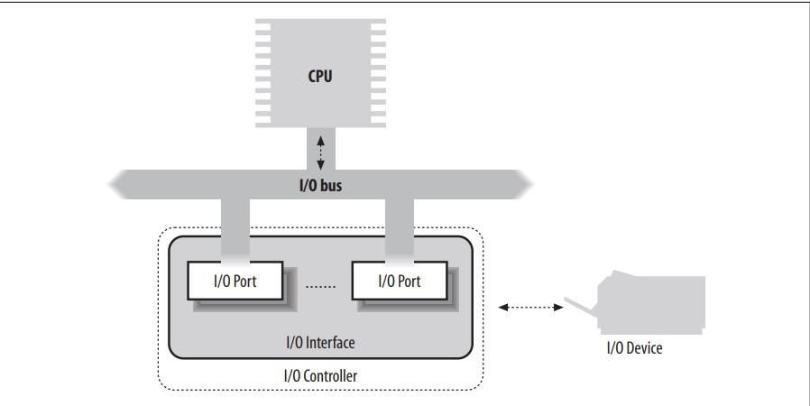
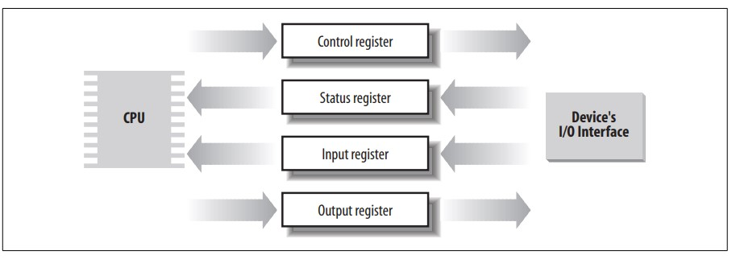
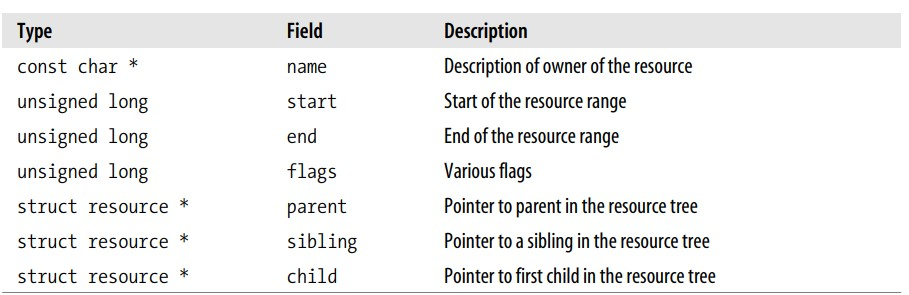

# Ch 13. I/O Architecture and Device Drivers

The Virtual File System in the last chapter depends on lower-level functions to carry out each read, write, or other operation in a manner suited to each device. The previous chapter included a brief discussion of how operations are handled by different filesystems.

In this chapter, we look at **how the kernel invokes the operations on actual devices.**

- In the section “I/O Architecture,” we give a brief survey of the 80 × 86 I/O architecture.
- In the section “The Device Driver Model,” we introduce the Linux device driver model.
- In the section “Device Files,” we show how the VFS associates a special file called “device file” with each different hardware device, so that application programs can use all kinds of devices in the same way.
- We then introduce in the section “Device Drivers” some common characteristics of device drivers.
- Finally, in the section “Character Device Drivers,” we illustrate the overall organization of character device drivers in Linux.

We’ll defer the discussion of block device drivers to the next chapters.

## I/O Architecture

To make a computer work properly, data paths must be provided that **let information flow between CPU(s), RAM, and the score of I/O devices that can be connected to a personal computer.**

- These data paths, which are denoted as the **buses**, act as the primary communication channels inside the computer.
- Any computer has a system bus that connects most of the internal hardware devices.
- A typical system bus is the PCI (Peripheral Component Interconnect) bus.
- Several other types of buses, such as ISA, EISA, MCA, SCSI, and USB, are currently in use.

Typically, the same computer includes several buses of different types, linked together by hardware devices called **bridges**.

- Two high-speed buses are dedicated to the data transfers to and from the memory chips:
  - the frontside bus connects the CPUs to the RAM controller, while 
  - the backside bus connects the CPUs directly to the external hardware cache.
- The host bridge links together the system bus and the frontside bus.

**Any I/O device is hosted by one, and only one, bus.**

- The bus type affects the internal design of the I/O device, as well as how the device has to be handled by the kernel.
- In this section, we discuss the functional characteristics common to all PC architectures, without giving details about a specific bus type.
- The data path that connects a CPU to an I/O device is generically called an **I/O bus**.
- The 80 × 86 microprocessors use 16 of their address pins to address I/O devices and 8, 16, or 32 of their data pins to transfer data.
- The I/O bus, in turn, is connected to each I/O device by means of a hierarchy of hardware components including up to three elements: I/O ports, interfaces, and device controllers.

## I/O Ports

Each device connected to the I/O bus has its own set of **I/O addresses**, which are usually called **I/O ports**.

- In the IBM PC architecture, the I/O address space provides up to 65,536 8-bit I/O ports.
- Two consecutive 8-bit ports may be regarded as a single 16-bit port, which must start on an even address.
- Similarly, two consecutive 16-bit ports may be regarded as a single 32-bit port, which must start on an address that is a multiple of 4.
- Four special assembly language instructions called `in`, `ins`, `out`, and `outs` allow the CPU to read from and write into an I/O port.
- While executing one of these instructions, the CPU selects the required I/O port and transfers the data between a CPU register and the port.

- I/O ports may also be mapped into addresses of the physical address space.
- The processor is then able to **communicate with an I/O device by issuing assembly language instructions** that operate directly on memory (for instance, `mov`, `and`, `or`, and so on).
- Modern hardware devices are more suited to mapped I/O, because it is faster and can be combined with DMA.
- An important objective for system designers is to offer a unified approach to I/O programming without sacrificing performance. Toward that end, the I/O ports of each device are structured into a set of specialized registers:

- The CPU writes the commands to be sent to the device into the device control register and reads a value that represents the internal state of the device from the device status register.
- The CPU also fetches data from the device by reading bytes from the device input register and pushes data to the device by writing bytes into the device output register.
- To lower costs, the same I/O port is often used for different purposes.
- For instance, some bits describe the device state, while others specify the command to be issued to the device.
- Similarly, the same I/O port may be used as an input register or an output register.

## Accessing I/O ports

- The `in`, `out`, `ins`, and `outs` assembly language instructions access I/O ports.
- The following auxiliary functions are included in the kernel to simplify such accesses:

- `inb()`, `inw()`, `inl()`
  - Read 1, 2, or 4 consecutive bytes, respectively, from an I/O port. The suffix “b,” “w,” or “l” refers, respectively, to a byte (8 bits), a word (16 bits), and a long (32 bits).
- `inb_p()`, `inw_p()`, `inl_p()`
  - Read 1, 2, or 4 consecutive bytes, respectively, from an I/O port, and then execute a “dummy” instruction to introduce a pause
- `outb()`, `outw()`, `outl()`
  - Write 1, 2, or 4 consecutive bytes, respectively, to an I/O port.
- `outb_p()`, `outw_p()`, `outl_p()`
  - Write 1, 2, and 4 consecutive bytes, respectively, to an I/O port, and then execute a “dummy” instruction to introduce a pause.
- `insb()`, `insw()`, `insl()`
  - Read sequences of consecutive bytes in groups of 1, 2, or 4, respectively, from an I/O port.
  - The length of the sequence is specified as a parameter of the functions.
- `outsb()`, `outsw()`, `outsl()`
  - Write sequences of consecutive bytes, in groups of 1, 2, or 4, respectively, to an I/O port.

- While accessing I/O ports is simple, detecting which I/O ports have been assigned to I/O devices may not be easy, in particular, for systems based on an ISA bus.
- **Often a device driver must blindly write into some I/O port to probe the hardware device**; if, however, this I/O port is already used by some other hardware device, a system crash could occur.
- To prevent such situations, the kernel keeps track of I/O ports assigned to each hardware device by means of “resources.”
- A resource represents a portion of some entity that can be exclusively assigned to a device driver. In our case, a resource represents a range of I/O port addresses.
- The information relative to each resource is stored in a resource data structure, whose fields are shown in Table 13-1.

- All resources of the same kind are inserted in a treelike data structure; for instance, all resources representing I/O port address ranges are included in a tree rooted at the node `ioport_resource`.
  - The children of a node are collected in a list whose first element is pointed to by the child field.
  - The sibling field points to the next node in the list.
- Why use a tree?
  - Well, consider, for instance, the I/O port addresses used by an IDE hard disk interface—let’s say from 0xf000 to 0xf00f.
  - A resource with the start field set to 0xf000 and the end field set to 0xf00f is then included in the tree, and the conventional name of the controller is stored in the name field.
  - However, the IDE device driver needs to remember another bit of information, namely that the subrange from 0xf000 to 0xf007 is used for the master disk of the IDE chain, while the subrange from 0xf008 to 0xf00f is used for the slave disk. To do this, the device driver inserts
two children below the resource corresponding to the whole range from 0xf000 to
0xf00f, one child for each subrange of I/O ports. As a general rule, each node of the
tree must correspond to a subrange of the range associated with the parent. The root
of the I/O port resource tree (ioport_resource) spans the whole I/O address space
(from port number 0 to 65535).
Each device driver may use the following three functions, passing to them the root
node of the resource tree and the address of a resource data structure of interest:
request_resource()
Assigns a given range to an I/O device.
allocate_resource( )
Finds an available range having a given size and alignment in the resource tree; if
it exists, assigns the range to an I/O device (mainly used by drivers of PCI
devices, which can be configured to use arbitrary port numbers and on-board
memory addresses).
release_resource( )
Releases a given range previously assigned to an I/O device.
The kernel also defines some shortcuts to the above functions that apply to I/O
ports: request_region() assigns a given interval of I/O ports and release_region()
releases a previously assigned interval of I/O ports. The tree of all I/O addresses currently assigned to I/O devices can be obtained from the /proc/ioports file.